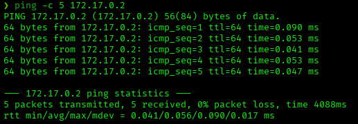

# BreakMySSH — DockerLabs Writeup

**Platform:** DockerLabs · **Difficulty:** Very Easy · **Target IP:** 172.17.0.2 · **Attacker IP:** 172.17.0.1

## Summary

BreakMySSH is a very easy machine centered entirely around a single exposed service: SSH. The path to root involves enumerating valid usernames through an OpenSSH vulnerability, brute-forcing weak credentials, discovering a hashed password left in a world-readable file, cracking it, and escalating directly to root via `su`.

**Attack chain:** Recon → SSH username enumeration (CVE-2018-15473) → Hydra brute-force → SSH login as `lovely` → Manual enumeration finds hashed password in `/opt/.hash` → Hash cracked with John → `su root` → root

## 1. Reconnaissance

Confirmed the host was reachable, then ran a full TCP port scan with service/version detection and default scripts.

```bash
ping -c 5 172.17.0.2
nmap -p- -sS -sC -sV -vvv --open -oN scan.txt 172.17.0.2
```



**Results:**

| Port | Service | Version |
|------|---------|---------|
| 22/tcp | ssh | OpenSSH 7.7 (protocol 2.0) |

Only one port open. With a single service exposed, and the machine's own name ("BreakMySSH") hinting at the intended attack surface, SSH was the sole avenue to enumerate.

## 2. SSH Enumeration

OpenSSH 7.7 is affected by **CVE-2018-15473**, a username enumeration vulnerability that abuses a timing/response discrepancy during authentication, allowing an attacker to confirm whether a given username exists without valid credentials.

Ran Metasploit's `ssh_enumusers` auxiliary module against the target:
